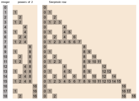
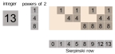

Let _B(n)_ be the set of powers of two that sum up to _n_. 
Then the Sierpinski row _S(n)_ contains all numbers _s_ for whom _B(s)_ is a subset of _B(n)_.

First 19 inputs and outputs of this function,
with the input's binary representation in between:

Example: `int_to_sierpinski_row(13)` gives `[0, 1, 4, 5, 8, 9, 12, 13]`. 
Instead set of binary exponents can be used as an alternative argument: `int_to_sierpinski_row(exposet={0, 2, 3})`

How the row is calculated:

