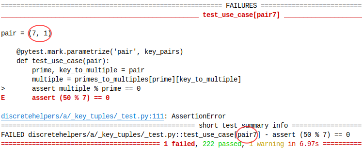

One of the use cases of `key_tuples` is for tests, where `@pytest.mark.parametrize` is used with nested data.
An example is shown in the test file as `test_use_case`.
When the 49 in the last list of `primes_to_multiples` is replaced by 50, this is how the result looks like:

