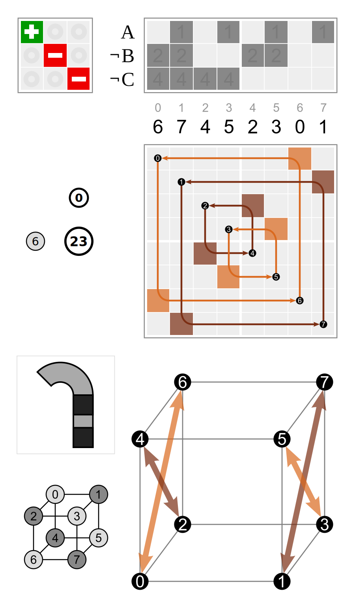
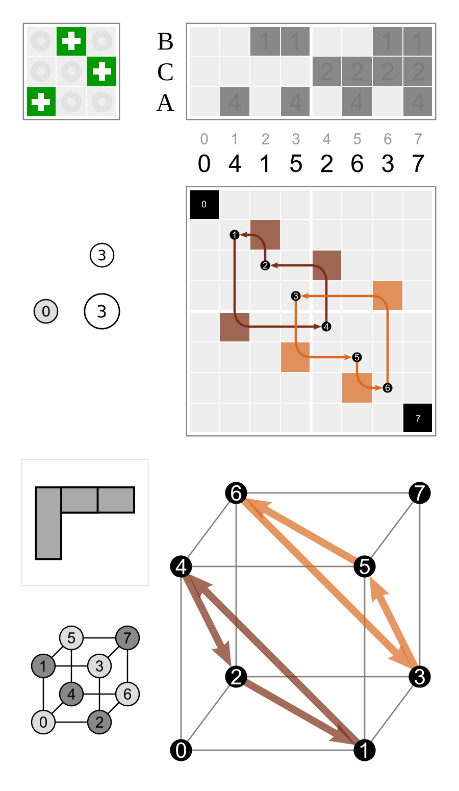
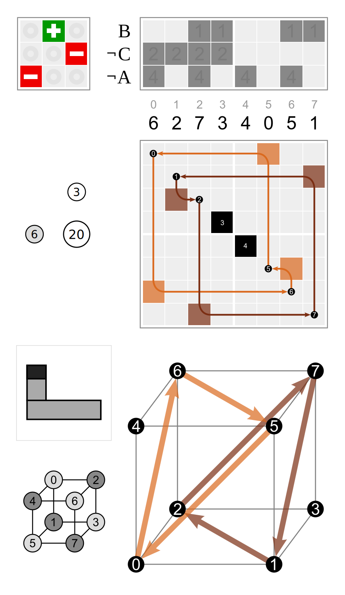

# `logic_negate_vector`

```python
from discretehelpers.a import logic_abs, logic_negate_vector
```

## `where`

```python
logic_negate_vector([2, 5, 77, 8, 9, 88, 77], where=[0, 0, 0, 0, 1, 1, 0]) == [2, 5, 77, 8, ~9, ~88, 77]
```

## `which`

```python
logic_negate_vector([2, 5, 77, 8, 9, 88, 77], which={77, 88}) == [2, 5, ~77, 8, 9, ~88, ~77]
```

### signed permutations

This is used to get signed permutations from the pairs (_m_, _n_) denoting elements of the hyperoctahedral group:

_n_ = 3 represents the permutation `[2, 0, 1]`.

_m_ = 6 represents the negator pattern `[0, 1, 1]`, i.e. elements 1 and 2 are negated.

```python
logic_negate_vector([2, 0, 1], which={1, 2}) == [~2, 0, ~1]
```

<table>
    <tr>
        <td>(6, 0)</td>
        <td rowspan="2">after</td>
        <td>(0, 3)</td>
        <td rowspan="2">=</td>
        <td>(6, 3)</td>
    </tr>
    <tr>
        <td>
            <a href="https://commons.wikimedia.org/wiki/File:Cube_permutation_6_0.svg">
                
            </a>
        </td>
        <td>
            <a href="https://commons.wikimedia.org/wiki/File:Cube_permutation_0_3.svg">
                
            </a>
        </td>
        <td>
            <a href="https://commons.wikimedia.org/wiki/File:Cube_permutation_6_3.svg">
                
            </a>
        </td>
    </tr>
</table>