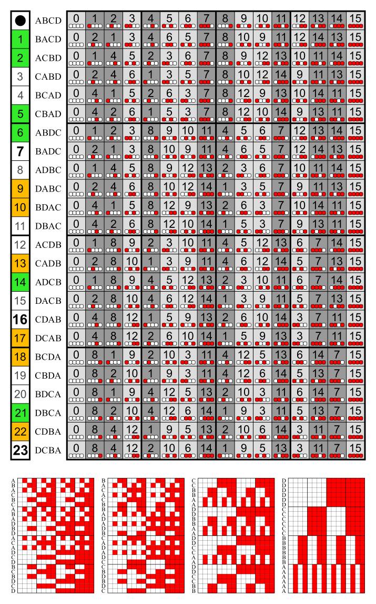

# Schoute coset

The matrix whose rows are [Schoute permutations](../../perm/properties/schoute_perm) shall be called Schoute matrix.<br>
This is the passive S. m., showing the results of applying the permutations .

<a href="https://commons.wikimedia.org/wiki/File:Consecutive_bit_permutations_24x16.svg">
    
</a>

The pattern of one column could be called Schoute partition.<br>
The pattern of a single entry in one column shall be called Schoute coset.

The function `schoute_coset_gen` has the arguments `key_int`, `val_int` and `arity`.<br>
For the shown matrix `key_int` corresponds to the entry and `val_int` to the column.<br>
The `arity` is 4.

The following code shows the positions of entry 4 in column 2,<br>
and the positions of entry 6 in colum 12.

```python
from discretehelpers.a import schoute_coset_gen


sorted(schoute_coset_gen(4, 2, 4)) == [2, 3, 8, 9, 22, 23]
sorted(schoute_coset_gen(6, 12, 4)) == [12, 14, 18, 20]
```

There is also the active Schoute matrix, whose rows show the permutations as maps.<br>
For it `key_int` corresponds to the column and `val_int` to the entry.
