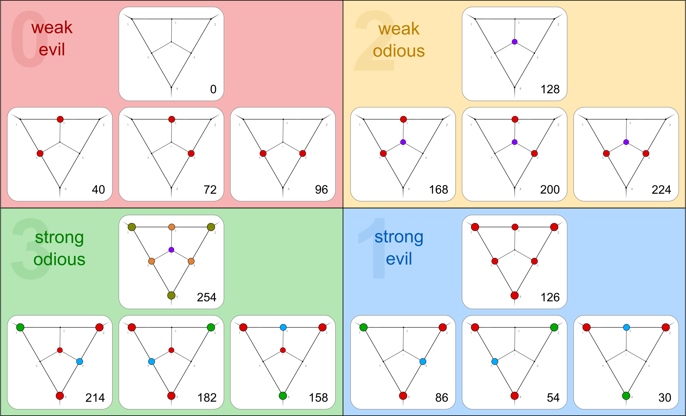

# noble

Nobles are fixed points in the [Zhegalkin permutation](https://en.wikiversity.org/wiki/Zhegalkin_matrix).
They form the number triangle [A358167](https://oeis.org/A358167).


These are the 16 noble Zhegalkin indices for arity 3:<br>
`0,  30,  40, 54,  72, 86, 96, 126, 128, 158, 168, 182, 200, 214, 224, 254`

And these are the corresponding Boolean functions ordered in four quadrants:

<a href="https://commons.wikimedia.org/wiki/File:Noble_3-ary_Boolean_functions.svg">
    
</a>

For arities &ge; 2 there are four quadrants.<br>
(For arity 1 there are two, and for arity 0 there is only one.)

Each noble has a corresponding royal in quadrant 0.<br>
This function takes a noble and the arity, and returns the quadrant and the royal.<br>
This pair uniquely identifies a noble.

```python
from discretehelpers.boolf.a import noble_to_royal, noble_to_quadrant

assert noble_to_royal(168, 3) == 40
assert noble_to_quadrant(168, 3) == 2
```


## index to noble (and back)

`index_to_noble(k, n)` gives entry _k_ of row _n_ in triangle [A358167](https://oeis.org/A358167).<br>
`noble_to_index(noble, n)` gives `k`.

``` 
     k  0   1   2   3   4   5   6    7    8    9   10   11   12   13   14   15
n
1       0   2
2       0   6   8  14
3       0  30  40  54  72  86  96  126  128  158  168  182  200  214  224  254
```

```python
from discretehelpers.boolf.a import index_to_noble, noble_to_index

assert index_to_noble(10, 3) == 168
assert noble_to_index(168, 3) == 10
```
