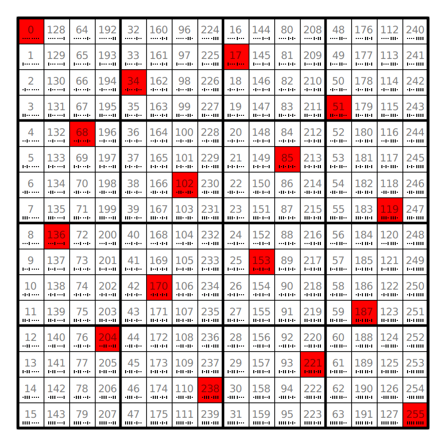

# praetor

`praetor_int` is the main ingredient of [`noble_to_index`](../_noble).

The following matrix shows the 3-ary Boolean functions with praetor 0. 
These are the 2-aries among the 3-aries. 
The entries form the bit-reversal permutation.

The following matrix shows the praetors 0, 9, 8, 1. 
The four highlighted fields are nobles.

