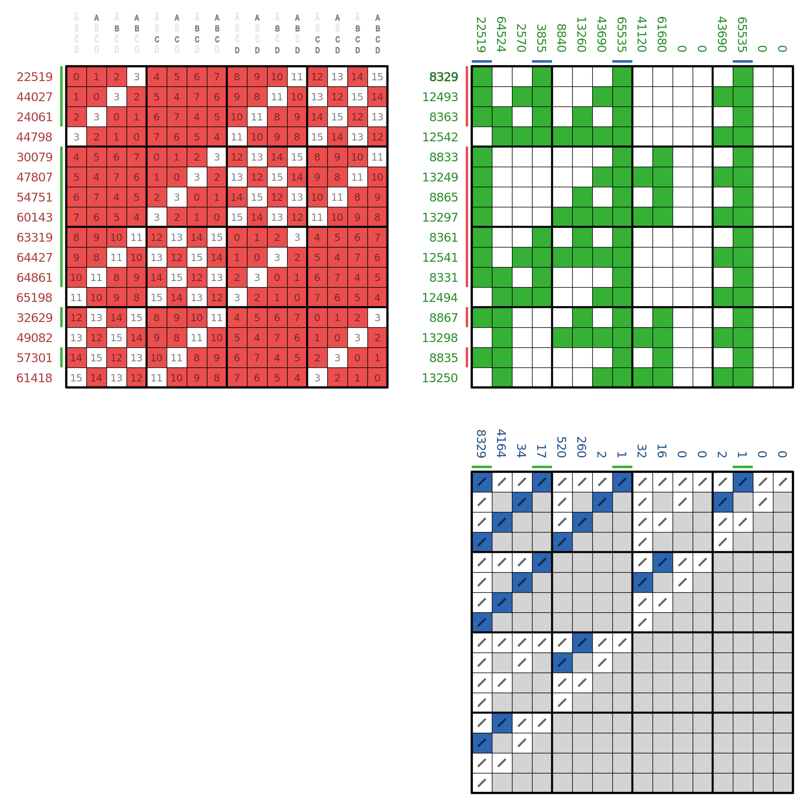
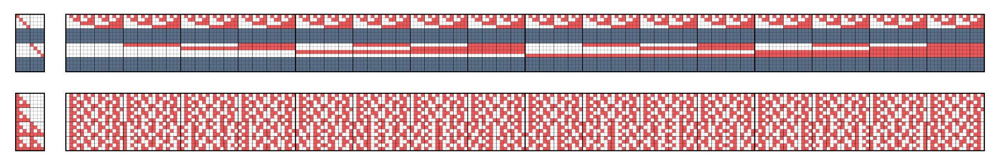

# Sierpinski Zhegalkin twin

This function calculates the Zhegalkin twin of a long truth table, whose true bits are within a
[NOR pattern](https://commons.wikimedia.org/wiki/File:Variadic_logical_NOR.svg).

The point is to cheaply calculate the green columns above the blue columns in files like this:

This is done by calculating the twin of the short truth table (within the NOR pattern), 
and by then duplicating its entries according to a
[Sierpinski partition](../sierpinski_partition).

The upper long matrix in the following file shows truth tables of length 8 drawn apart to length 16. 
The lower long matrix shows the corresponding Zhegalkin twins.

The equivalent of column 4 of the blue and green matrix above is column 40 in the matrices below. 
(Note, that the green column is in the lower, and the blue column is the upper long matrix.)

