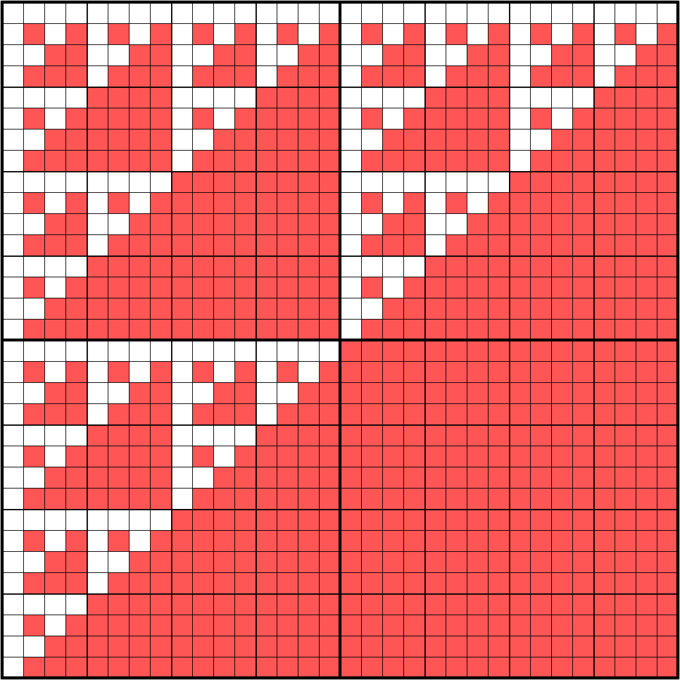

# simple gens (variadic Boolean functions)

<table>
<tr>
    <td colspan="2">
        
         EQ
    </td>
</tr>
<tr>
    <td>
        
         AND
    </td>
    <td>
        
         OR
    </td>
</tr>
<tr>
    <td>
        
         XAND
    </td>
    <td>
        
         XOR
    </td>
</tr>
<tr>
    <td>
        
         SAND
    </td>
    <td>
        
         GAND
    </td>
</tr>
<tr>
    <td>
        
         ESAND
    </td>
    <td>
        
         OSAND
    </td>
</tr>
</table>