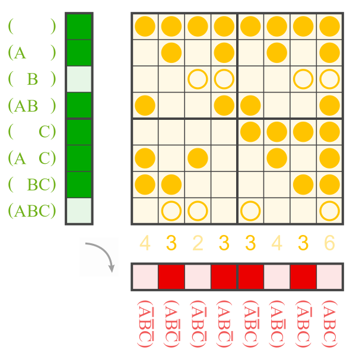
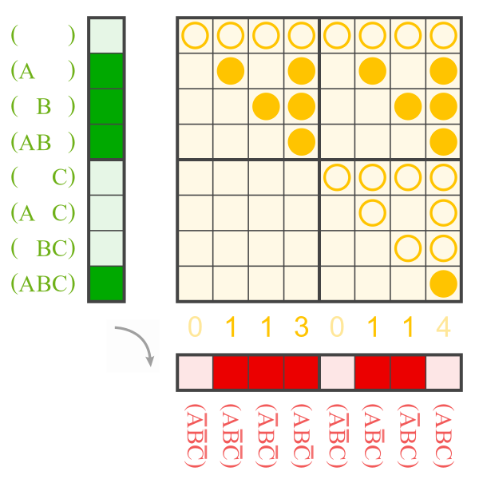

# Zhegalkin twins (and prefects)

Triangle [A197819](https://oeis.org/A197819) of Zhegalkin permutations.

``` 
     k   0   1   2   3   4   5   6   7   8   9  10  11  12  13  14  15
n 
0       (0) (1)
1       (0)  3  (2)  1
2       (0) 15  10   5  12   3  (6)  9  (8)  7   2  13   4  11 (14)  1
```

```python
from discretehelpers.boolf.a import twin_int


assert twin_int(15, 2) == 1  # index before arity
```

Compare [`noble`](../noble) for the fixed points.

Wikiversity: [Zhegalkin matrix](https://en.wikiversity.org/wiki/Zhegalkin_matrix)


## prefect

One can use XAND instead of AND to generate the rows of the yellow matrix.<br>
The result is always a linear Boolean function, which shall be called the prefect of the input.

## examples

<table>
    <tr>
        <th>Zhegalkin twins</th>
        <th>prefect</th>
    </tr>
    <tr>
        <td>
            <a href="https://commons.wikimedia.org/wiki/File:ANF_to_1011_0010.svg">
                
            </a>
            <br>
            123 (green) and 77 (red) are Zhegalkin twins.
        </td>
        <td>
            <a href="https://commons.wikimedia.org/wiki/File:Zhe_1101_1110_(123)_to_prefect_5.svg">
                
            </a>
            <br>
            The Boolean function with Ж 123 has prefect 5.
        </td>
    </tr>
    <tr>
        <td>
            <a href="https://commons.wikimedia.org/wiki/File:ANF_to_0111_0110.svg">
                
            </a>
            <br>
            142 (green) and 110 (red) are Zhegalkin twins.
        </td>
        <td>
            <a href="https://commons.wikimedia.org/wiki/File:Zhe_0111_0001_(142)_to_prefect_~7.svg">
                
            </a>
            <br>
            The Boolean function with Ж 142 has prefect &not;7.
        </td>
    </tr>
</table>

