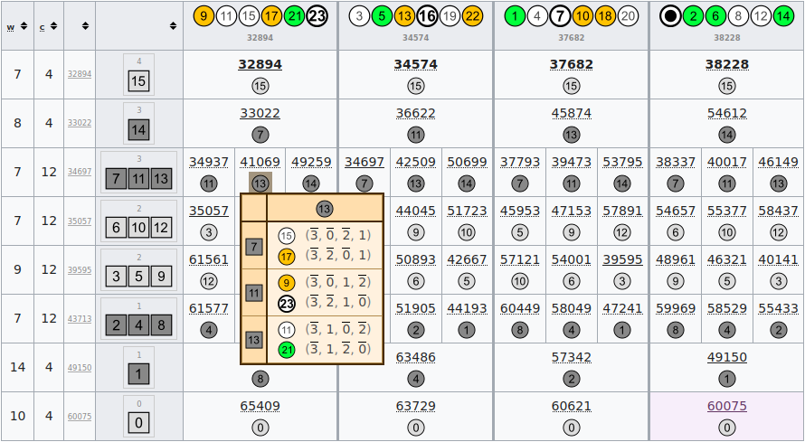

# clan matrix wiki

creates a Wiki table based on [ec_clan_matrix](../ec_clan_matrix)

[Studies of Euler diagrams/NP tables](https://en.wikiversity.org/wiki/Studies_of_Euler_diagrams/NP_tables)

[Category:Studies of Euler diagrams; templates; NP tables](https://en.wikiversity.org/wiki/Category:Studies_of_Euler_diagrams;_templates;_NP_tables)

The screenshot below is of [_tabita_ NP table](Template:Studies of Euler diagrams/tabita NP table).
The small hover table shows the transformations from _tabita_ to `Boolf(zhe=41069)`.

