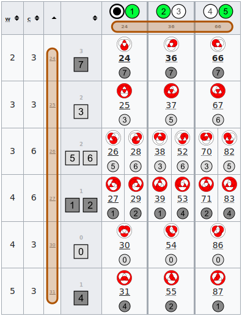

# clan partitioned 

Clan partitioned into 3 families (columns) and 6 factions (rows). 
The 18 splinters in which they intersect contain 1 or 2 functions.

Each row or column is a set of Zhegalkin indices. 
The smallest in each set is its representative. (Marked brown in the image below.)

Each splinter is denoted by the pair of representatives. 
The dict has these pairs as keys, and the lists of Zhegalkin indices as values.

The result contains many parts. See [test](_test.py) for details.

This is used in [ec_family_splinters](../ec_family_splinters) (which is not efficient).

The method [ec_clan_matrix_wiki](../ec_clan_matrix_wiki) gives a result readable in Wikiversity.

