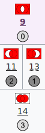
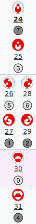
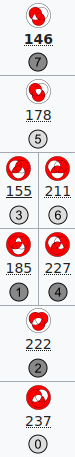
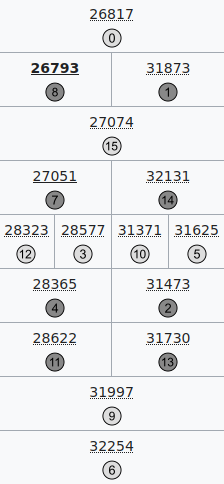

# family splinters

The following screenshots illustrate the [tests](_test.py).

<table>
<tr>
<td><a href="https://en.wikiversity.org/wiki/Template:Studies_of_Euler_diagrams/vinona_NP_table">vinona</a></td>
<td><a href="https://en.wikiversity.org/wiki/Template:Studies_of_Euler_diagrams/takate_NP_table">takate</a></td>
<td><a href="https://en.wikiversity.org/wiki/Template:Studies_of_Euler_diagrams/neralo_NP_table">neralo</a></td>
<td><a href="https://en.wikiversity.org/wiki/Template:Studies_of_Euler_diagrams/naruto_NP_table">naruto</a></td>
</tr>
<tr>
<td></td>
<td></td>
<td></td>
<td></td>
</tr>
</table>
