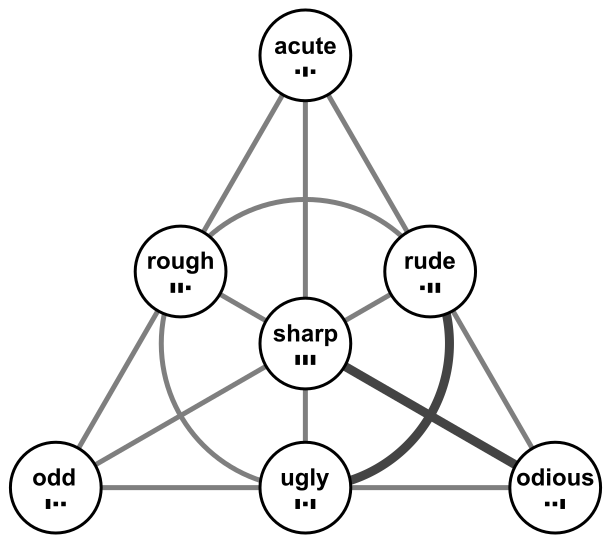
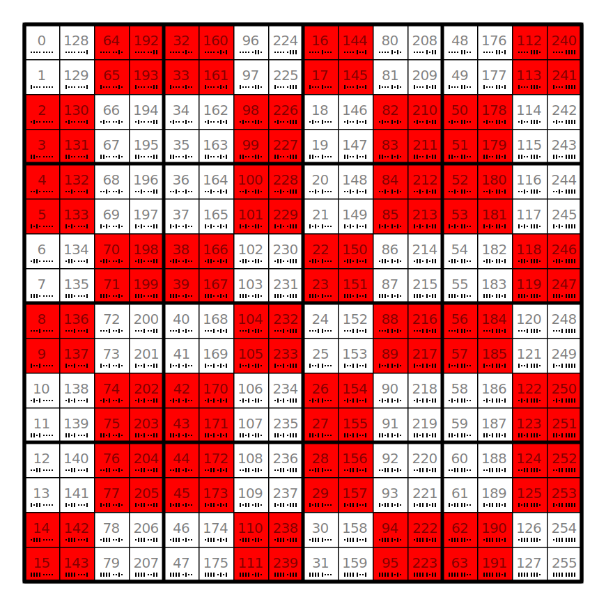
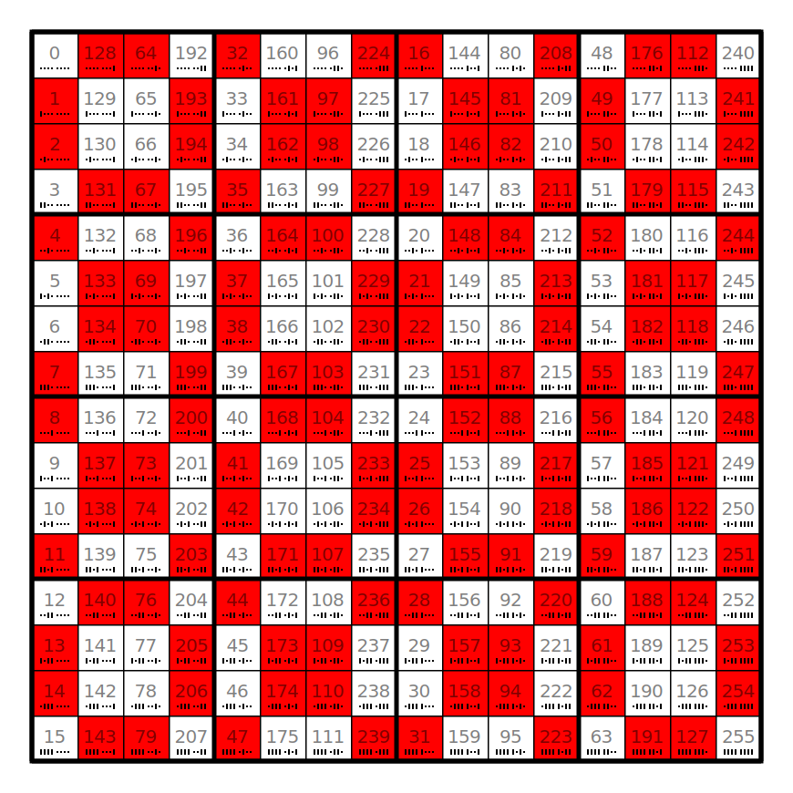
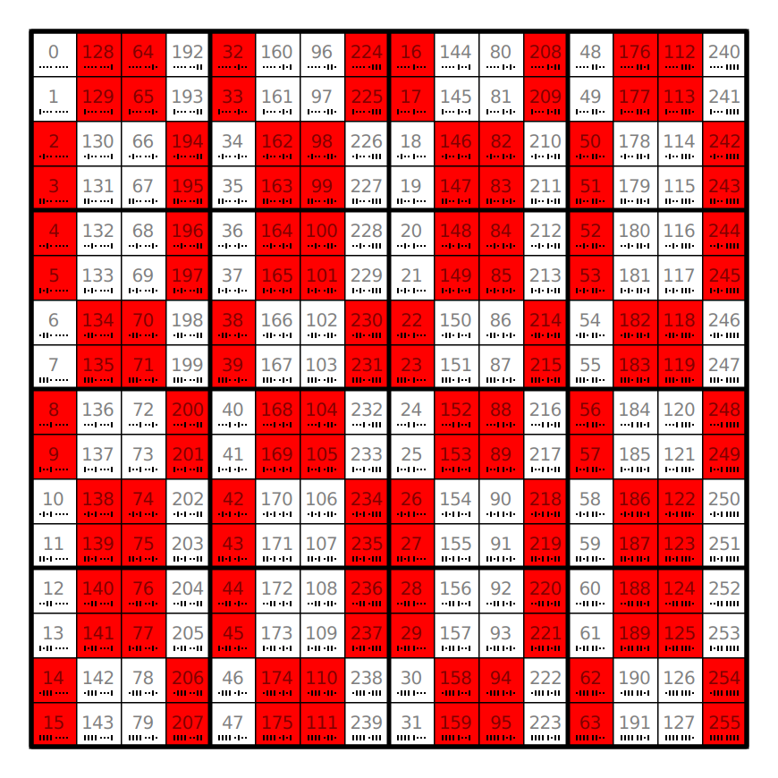
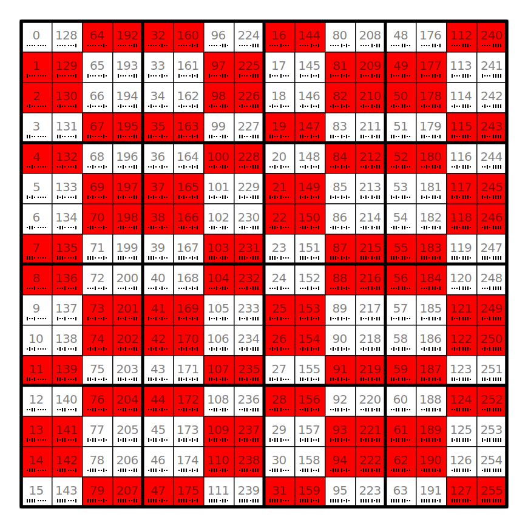

# foibles (four methods)

Compare the [three metributes](../../metributes/_foibles). 
The foibles dependent on arity are _sharp_, _acute_, _rude_ and _rough_.

## acute

Acuteness is a rather unintuitive property of a truth table.

* XOR of oddness, odiousness and sharpness, i.e. `self.is_ugly ^ self.is_sharp(arity)`.
* The [patron quadrant](../_patron) is 1 or 2, i.e. the patron's oddness and odiousness are different.
* The [weight quadrant](../_quadrant_extensions) is different from the quadrant.

See [conjecture](../../conjectures/3_acute).

## sharp

A truth table is sharp, if its weight is odd. 
As increasing the arity means doubling the weight, only the shortest truth table of a Boolf can be sharp.

The twin of a sharp Boolean function is odious.

## rude

Rude is sharp XOR odd. 
The twin of a rude Boolean function is ugly. 
Its reverse is rough.

## rough

Rough is sharp XOR odious. 
The twin of a rough Boolean function is also rough. 
Its reverse is rude.

