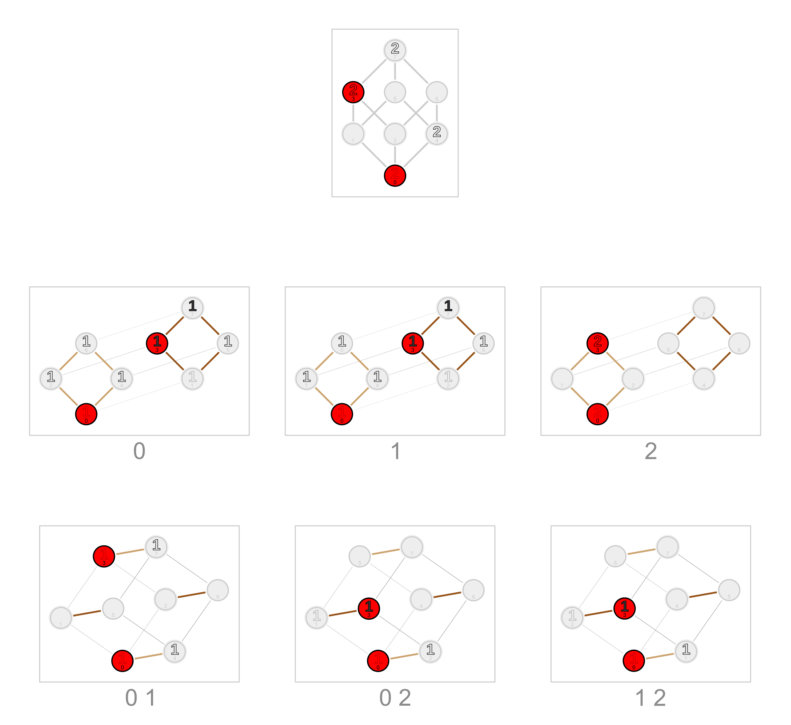
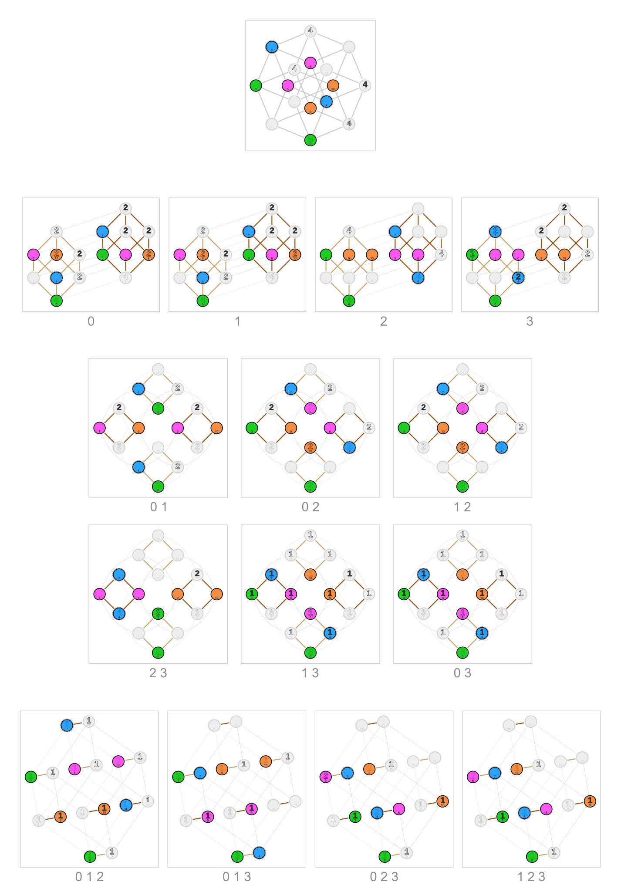
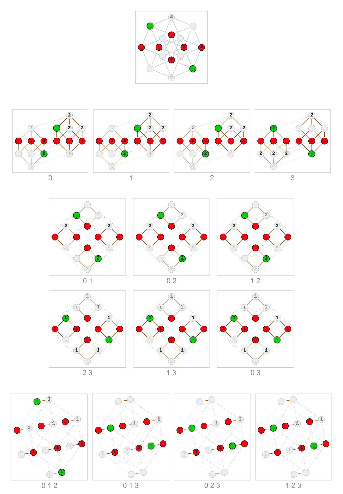
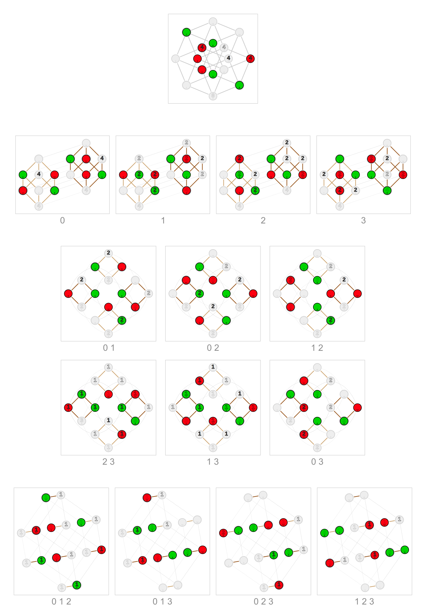

# hyperfissions

This is an extension of [fissions](../../metributes/_fissions) to multiple dimensions.
(While fissions are metributes, these are methods.)

See [test](_test.py) for examples.

The images below show graphs for all hyperfissions (including the fissions). 
The integers in the vertices are from the Walsh spectra. Those filled black are negative.

## _minase_

## _limona_

## _kovane_

## _pikobi_

