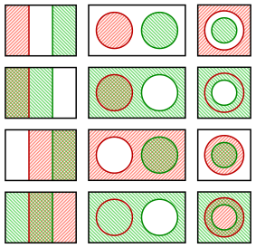
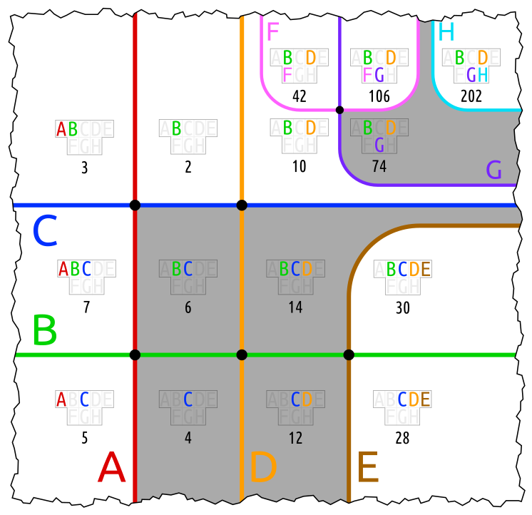

The arguments of this method are two atoms, whose borders do not intersect. 
It tells if the border of `a` is within `b`.

This is true, if `a` is a subset of `b`, and if the sets intersect. 
See the following image. There are two rows with a red border in the green area.

The example used in the test is _vumali_. 
The border _E_ is in the sets _C_ and _D_, because the set _E_ is their subset. 
The border _B_ is in the set _C_, and the border _C_ in the set _B_, because the sets intersect.

