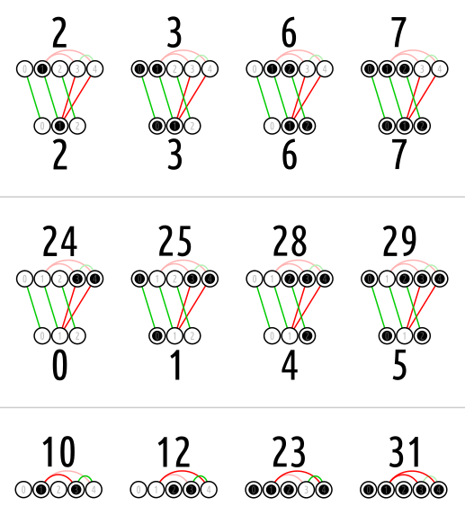

`spotint` denotes a spot of the `Boolf` (namely a cell of its Venn diagram or a digit of its truth table).

Because the `Boolf` is bloated, some places in its binary expression are connected, i.e. they are always the same (green) or opposite (red).

The binary expression of the result has only one digit for each group of connected digits.

The example uses the `bloat` of the Boolean function `tokosi` (compare `boolf.test.05_blight`). <br>
3 and 4 are equal, and both are complements of 1. (It is enough to state, that 1 and 3 are complements.)

```python
tokosi.bloat == SetPartComp([[3, 4]], {(1, 3)})
```

The image below illustrates the examples in the test, e.g.:
* `tokosi.bloatless_spotint(29) == 5`
* `tokosi.bloatless_spotint(23)` causes the exception `BloatMismatch`.

<a href="https://commons.wikimedia.org/wiki/File:EuDi;_bloatless_spotint_tokosi.svg">
    
</a>

[`blightless_spotint`](../blightless_spotint) extends this metribute.
