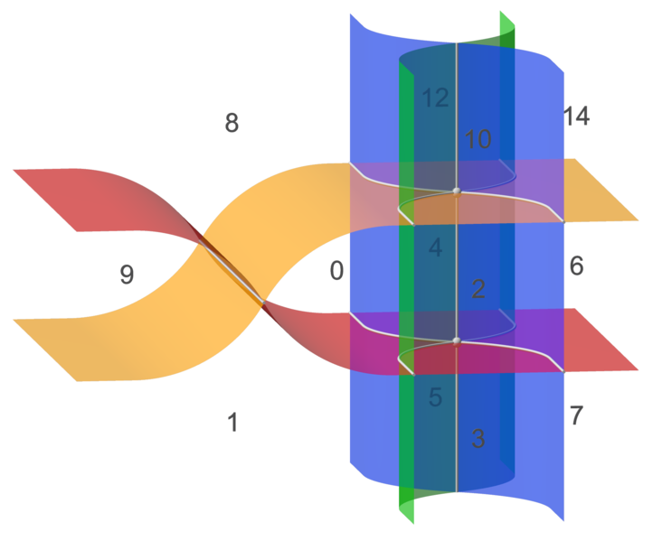
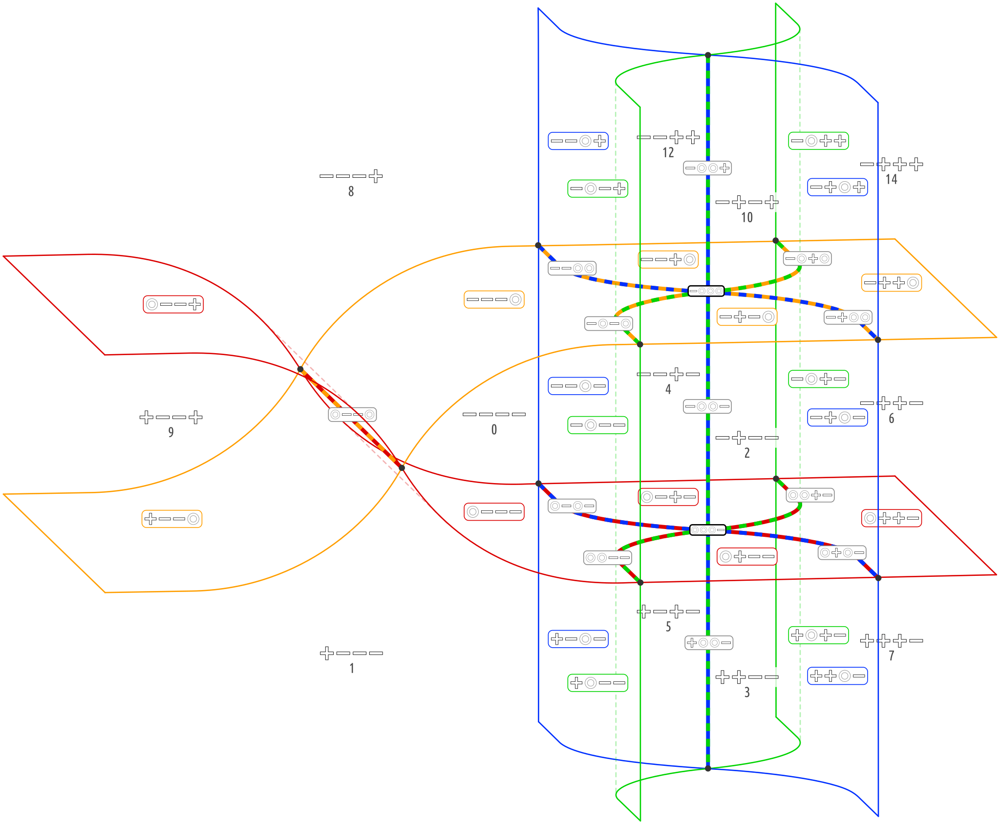

# current use

```python
all_connected, collection = boolf.find_segments()

collection.print_segments()
```

## segments

Segments describe the geometry of an Euler diagram, and include its cells and the walls between them.<br>
They are hyperfaces of the cross-polytope of dimension *arity*. (So their maximal number is 3<sup><i>arity</i></sup>.)<br>
They have balanced ternary labels. (In the same way that cells have binary labels.)

The term *dimension* is used somewhat counter-intuitively,<br>
as it corresponds to the hypercube, rather than to the cross polytope.<br>
The dimension of a segment is the number of zeros in its ternary expression.<br>
For the hypersplits it is used in the same way.

The relationships between segments that differ in only one digit are important:
* Another segment with a 0 in the differing place is a **superior**. (Points are superior to edges.)
* Equivalently, another segment with + or − in the differing place is an **inferior**. (Edges are inferior to points.) 
* Another segment with the opposite sign in the differing place is a **neighbor**.

The following images show the Euler diagram of *medusa*. The second one has balanced ternary labels for the segments.<br>
It has all 6 possible hypersplits of dimension 2. Each has a set of edges (at least one) as its core segments.<br>
It has 2 (of 4 possible) hypersplits of dimension 3, each corresponding to a point as its core segment. 

<a href="https://commons.wikimedia.org/wiki/File:EuDi;_medusa.png">
    
</a>
<br>
<a href="https://commons.wikimedia.org/wiki/File:EuDi;_medusa_ternary.svg">
    
</a>


## method `find_segments`

The main aim here is to find the gapspots required to draw a good Euler diagram.

The following geometric requirements can be used to add new segments, which may include gapspots:

* Each segment must have all its inferiors. (A point with 3 zeros requires 8 edges. They require faces, which require cells.)
* Neighboring segments require their common superior. (Two neighboring cells require the wall between them.)
* Each hypersplit must have at least one core segment. (If the respective borders cross, they must cross somewhere.)

The first two are always easy. The last is easy, when the hypersplit has only one 
[potential core segment](../../metributes/hypersplits_potential_cores).<br>

Hopefully, the additional requirement of connectedness will be fulfilled in the process.<br>
(All cells must be connected. All walls in the same border must be connected.)

### process

When a new cell is added, there could be new hypersplits, requiring new core segments.

When a new segment is added,
* it checks if its inferiors exist, and demands them if not;
* it checks if its neighbors exist, and demands the superior for each one that does.
