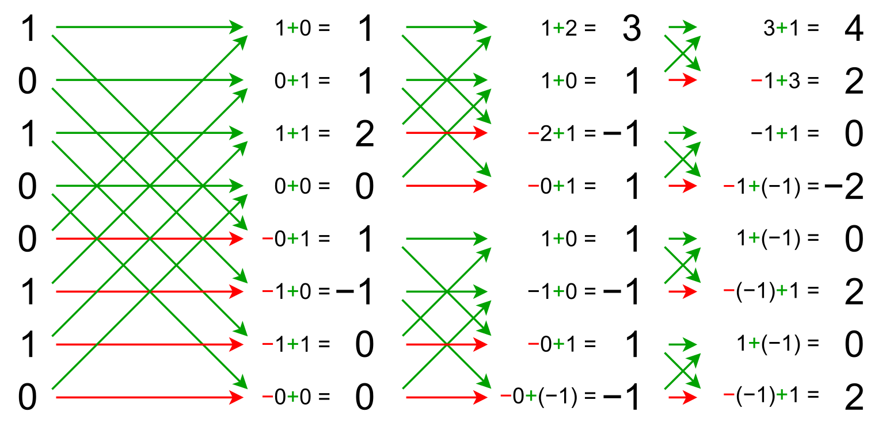
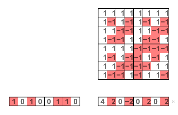

# Walsh spectrum

[Walsh–Hadamard transform](https://en.wikipedia.org/wiki/Fast_Walsh%E2%80%93Hadamard_transform)
of the Boolean function's truth table

For convenience `walsh_specrum_layered` shows the values in hypercube layers.

The images below show the Walsh spectrum of _gilipi_, which is used in the [test](_test.py).

<a href="https://commons.wikimedia.org/wiki/File:1010_0110_Walsh_spectrum_(fast_WHT).svg">
    
</a>

The Walsh spectrum is calculated with `sympy.fwht` (fast Walsh–Hadamard transform),<br>
but it is also the product of the truth table and a Walsh matrix.<br>
(Multiplying with a binary Walsh matrix would give the [binary Walsh spectrum](../consul),<br>
which is shown by the red backgrounds in the image below.)

<a href="https://commons.wikimedia.org/wiki/File:1010_0110_Walsh_spectrum_(single_row).svg">
    
</a>

The Walsh spectrum can contains 0s, if the weight of the truth table is even.<br>
The following code shows the Walsh spectra of a 3-ary truth table with weight 3, and its inflated 4-ary equivalent with weight 6. 

```python
from sympy import fwht


fwht([0, 0, 0, 1, 1, 0, 0, 1])
# [3, -1, -1, 3, -1, -1, -1, -1]

fwht([0, 0, 0, 1, 1, 0, 0, 1, 0, 0, 0, 1, 1, 0, 0, 1])
# [6, -2, -2, 6, -2, -2, -2, -2, 0, 0, 0, 0, 0, 0, 0, 0]
```

The inverse calculation can be done with `ifwht`.
```python
from sympy.discrete.transforms import ifwht


ifwht([3, -1, -1, 3, -1, -1, -1, -1])
# [0, 0, 0, 1, 1, 0, 0, 1]
```
