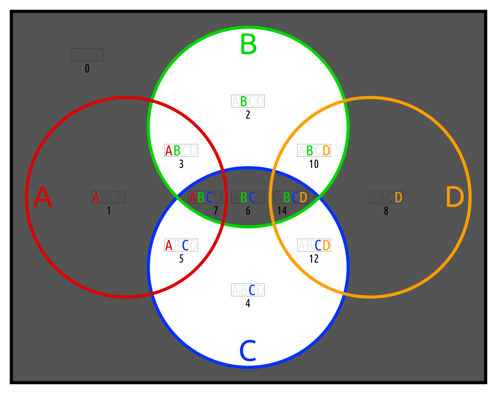
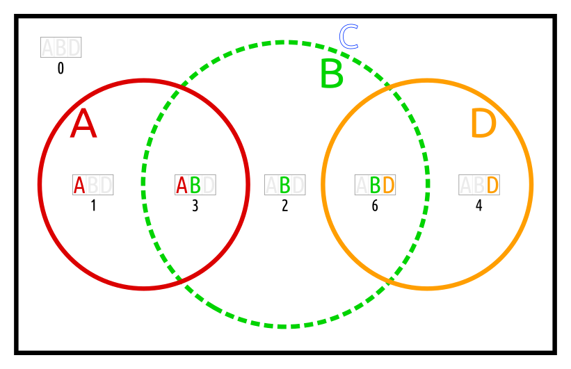
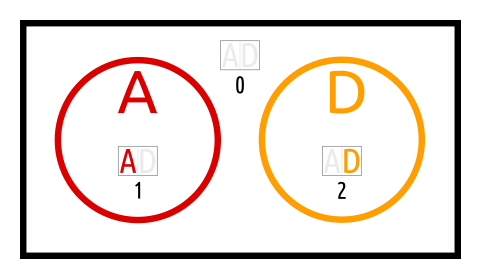
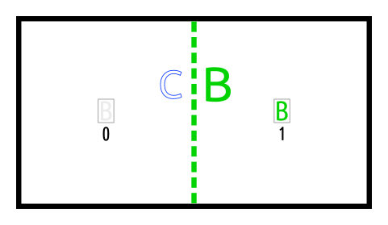

# inflation hidden by bloat

When a `Boolf` is initialized, it is checked for inflation by single sets, and [deflated](../../../a/_deflate). 
But when the inflating sets form a bloat with each other, they can not simply be discarded,
because the bloat is actual information.

## bareto

This example is like
*barogi*
(see [here](https://en.wikiversity.org/wiki/Studies_of_Euler_diagrams/examples#barogi)),
but with the added information, that B and C are complements.

The two bloated arguments _B_ and _C_ are replaced by _B_ alone. 
But _B_ does not add information to the Euler diagram of _A_ and _D_.

The arguments in the bloat part are disjoint from those in the bloatless part. 

Nonetheless, *bareto* is an actual 4-ary Boolean function. It is in clan 208.<!--TO DO: better clan index--> Its first appearance in
[this file](https://commons.wikimedia.org/wiki/File:4-ary_Boolean_functions_in_BEC_208_from_1001_1001_1001_0000.svg#File) is in row 2 of matrix 4.

`bareto_inflated` on the contrary is initialized with three arguments, but just the 2-ary Boolean function *barogi*.
