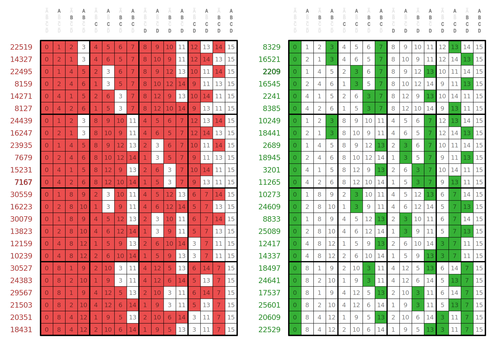

# Schoute wrapper (faction)

This function uses [schoute_coset_gen](../../../../../../a/schoute_coset_gen).

Take the following matrices for the example Boolf _farofe_:

The point of this wrapper is to get the complement of a column in the green matrix. 
It is the complement, because potential representatives are in the false places, 
which are here shown in white.

A slight complication is needed to make the code faster:

* If the layer is mostly true, it is efficient to find the few false places and return them. 
  (In this case `needles` are the false places of the layer.)
* But if the layer is mostly false, it is more efficient to find the few true places, and complement the result. 
  (In this case `needles` are the true places of the layer.)
