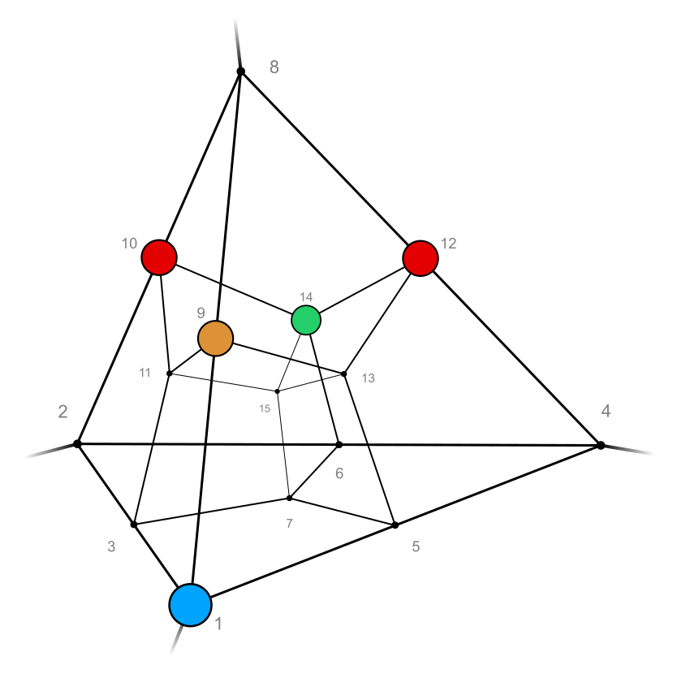
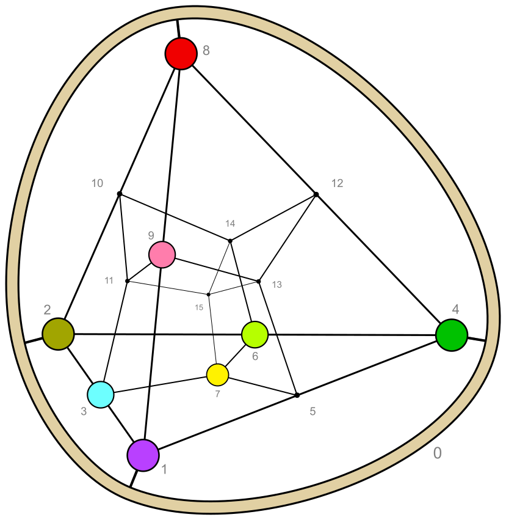
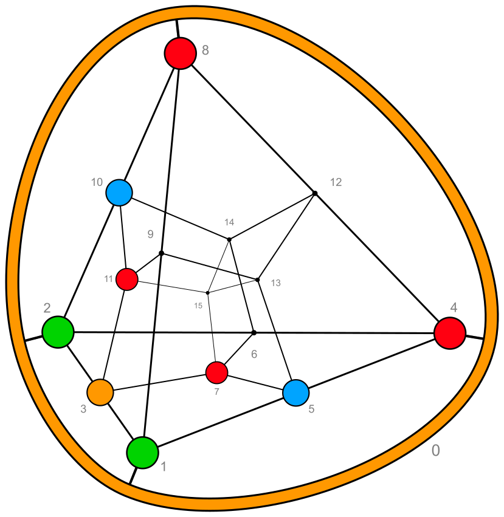

# fissions

Each _n_-ary Boolean function can be cut into _n_ fissions, which are pairs of (_n_&minus;1)-ary Boolean functions,<br>
by separating its hypercube graph along one dimension.

For technical simplicity they are pairs of `Binv` instead of `Boolf` objects.

There is also the derived property `fissions_layered`,
showing each function as a [`layered_tt`](../_layered/).

In the tesseract projections a fission is a pair containing the following parts:
* lower half: triangular side of the tetrahedron (together with the surrounding vertex 0)
* upper half: the cube in the opposite corner (including the central vertex 15)

## _savona_

This graph is mirror symmetric (with the two red vertices mapped onto each other),<br>
so two of the fissions are equal.


<br>


```python
from discretehelpers.boolf.examples import savona


savona.fissions
# [
#     [Binv('0000 0111'), Binv('1000 1000')], 
#     [Binv('0100 0110'), Binv('0000 1010')], 
#     [Binv('0100 0110'), Binv('0000 1010')], 
#     [Binv('0100 0000'), Binv('0110 1010')]
# ]
```

## _dakota_

This diagram has no symmetry. The first two weight layers are equal anyway.


<br>


```python
from discretehelpers.boolf.examples import dakota


dakota.fissions
# [
#     [Binv('1111 1000'), Binv('1101 1000')], 
#     [Binv('1110 1100'), Binv('1111 0000')], 
#     [Binv('1111 1100'), Binv('1011 0000')], 
#     [Binv('1111 1011'), Binv('1100 0000')]
# ]
```

## _fatale_


<br>


```python
from discretehelpers.boolf.examples import fatale


fatale.fissions
[
    [Binv('1110 1100'), Binv('1111 0100')],
    [Binv('1111 1000'), Binv('1101 1100')],
    [Binv('1111 1011'), Binv('1101 0000')],
    [Binv('1111 1101'), Binv('1011 0000')]
]
```