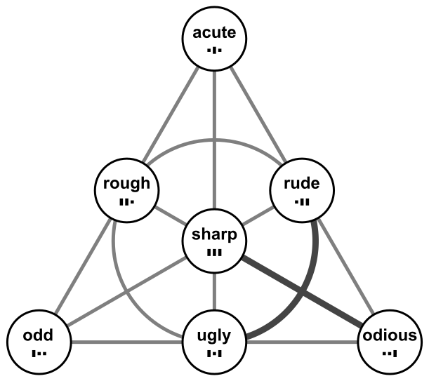

# foibles (three metributes)

Compare the [four methods](../../methods/_foibles). 
The foibles not dependent on arity are _odd_, _odious_ and _ugly_. 
(And there is the sharpness of the dense truth table.)

## odd &nbsp; (oddness)

The following image shows the 3-ary **even** functions. (The **odd** functions are their complements.) 
Above are the Zhegalkin indices, below the truth tables. 
In both the first digit is false.

## odious &nbsp; (odiousness)

The following image shows the 3-ary **evil** functions. (The **odious** functions are their complements.) 
Above are the Zhegalkin indices, below the truth tables. 
The weight of the Zhegalkin index is even, and the last digit of the truth table is false.

"Last digit" is somewhat ambiguous. Digit 7 is false in all columns. 
The first 8 columns are the 2-ary evil functions. For them digit 3 is also false. 
The first 2 columns are the 1-ary evil functions. For them digit 1 is also false.

## ugly

XOR of oddness and odiousness. 
A Boolean function is ugly, iff the first and last digit of its truth table are different.

## dense is sharp

Attribute `dense_tt` [is_sharp](../../methods/_foibles).