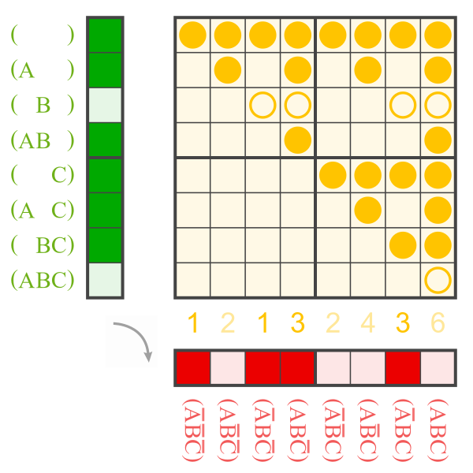
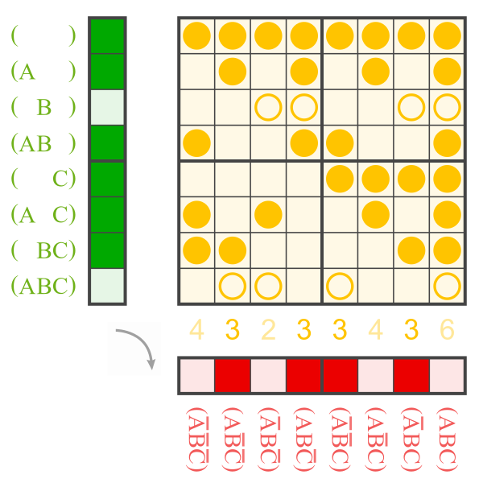
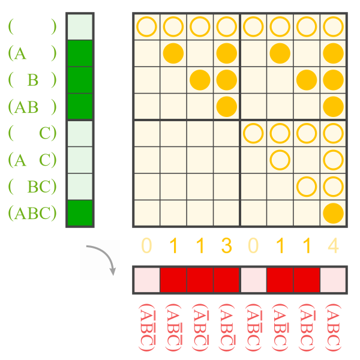
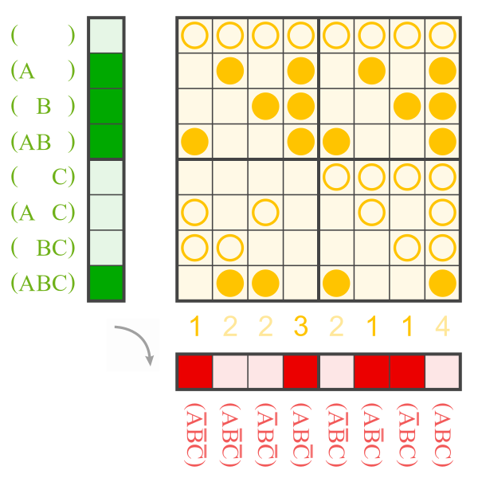

# prefect

Each Boolean function can be assigned a linear function, i.e. a Walsh function or its complement.<br>
The calculation is similar to that from an ANF to its Boolean function.<br>
It uses a matrix of variadic XANDs rather than ANDs. (See the yellow matrices below.)

The pair `prefect_walsh_and_oddness` is the Walsh index and a boolean for negation.

The Walsh index is the bitwise XOR of the binary exponents of the Zhegalkin index.
(compare sequence [A261283](https://oeis.org/A261283))


## example Ж 123

```python
from discretehelpers.boolf import Boolf
from discretehelpers.binv import Binv


boolf = Boolf('1011 0010')
assert boolf.prefect_boolf == Boolf('0110', [0, 2])
assert boolf.prefect_tt == Binv('0101 1010')
assert boolf.prefect_walsh_and_oddness == (5, False)
```

<table>
    <tr>
        <th>Ж to Boolean function</th>
        <th>Ж to prefect</th>
    </tr>
    <tr>
        <td>
            <a href="https://commons.wikimedia.org/wiki/File:ANF_to_1011_0010.svg">
                
            </a>
        </td>
        <td>
            <a href="https://commons.wikimedia.org/wiki/File:Zhe_1101_1110_(123)_to_prefect_5.svg">
                
            </a>
        </td>
    </tr>
</table>

## example Ж 142

```python
boolf = Boolf('0111 0110')
assert boolf.prefect_boolf == Boolf('1001 0110')
assert boolf.prefect_walsh_and_oddness == (7, True)
```

<table>
    <tr>
        <td>
            <a href="https://commons.wikimedia.org/wiki/File:ANF_to_0111_0110.svg">
                
            </a>
        </td>
        <td>
            <a href="https://commons.wikimedia.org/wiki/File:Zhe_0111_0001_(142)_to_prefect_~7.svg">
                
            </a>
        </td>
    </tr>
</table>
