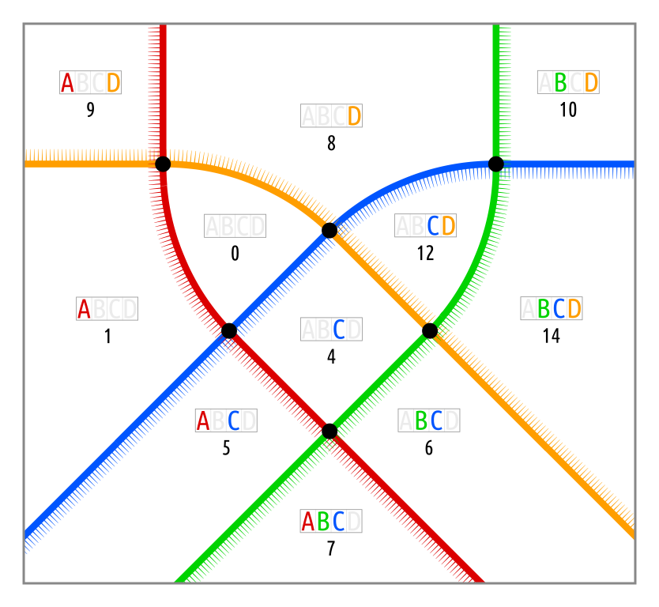
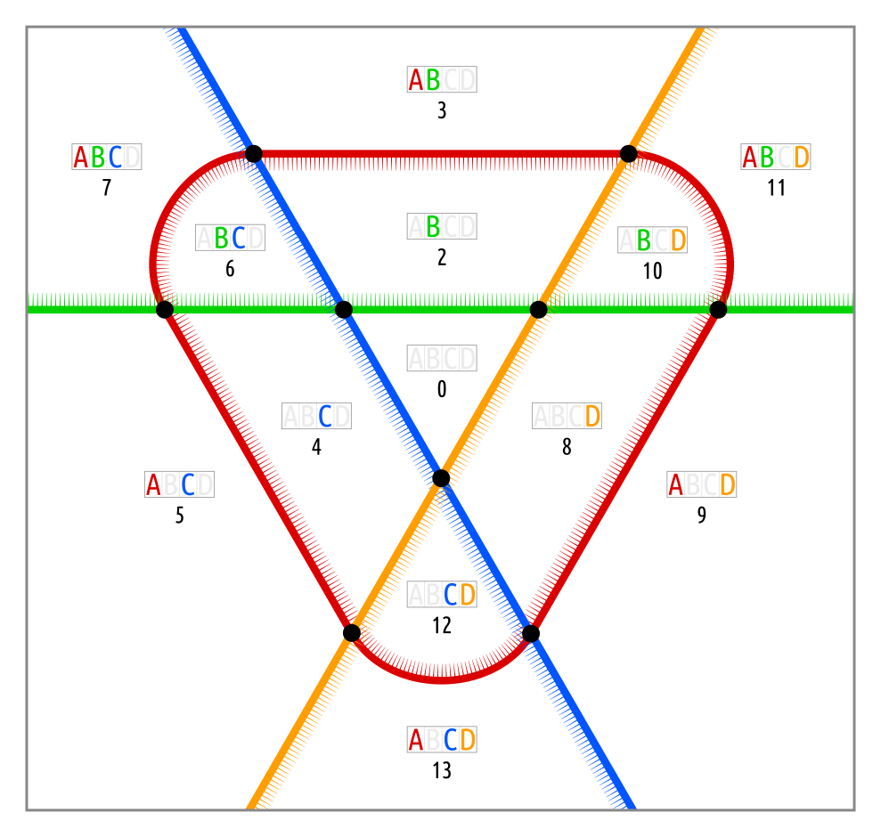
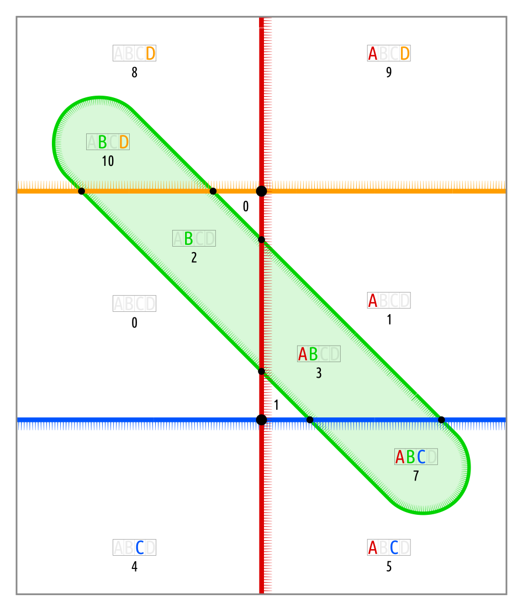

# symmetry

This property describes the symmetry of the Euler diagram. 
It is a list of fullspots, that are symmetric to each other.

## _niliko_ with mirror symmetry

`niliko.symmetric_cells == [[0, 12], [1, 14], [5, 6], [9, 10]]`

## _tabita_ with 3-fold dihedral symmetry

`tabita.symmetric_cells == [[2, 4, 8], [3, 5, 9], [6, 10, 12], [7, 11, 13]]`

## _levana_ with 2-fold rotational symmetry

`levana.symmetric_cells == [[0, 1], [2, 3], [4, 9], [5, 8], [7, 10]]`

