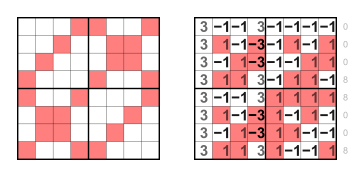

# family representative for sharp functions

Sharp Boolean functions have a short truth table with odd weight. 
Calculating their representative is easy, 
because the functions in the family have all possible [binary Walsh spectra](../../../../methods/consul). 
The function where it has only zeros is chosen as representative.

