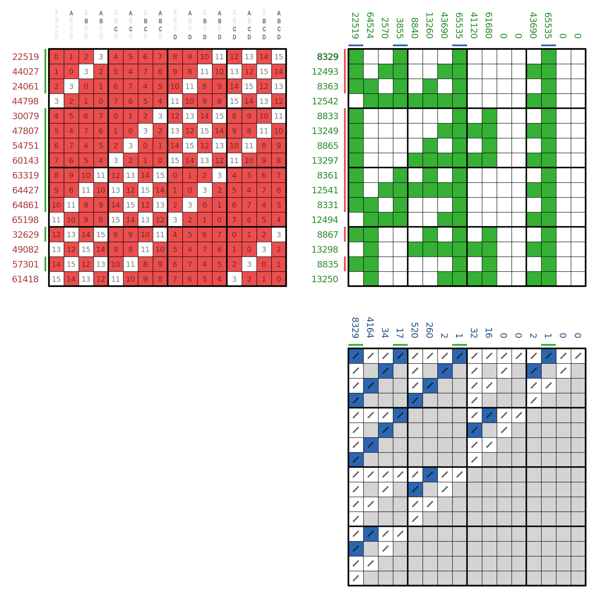

# family representative (smallest Zhegalkin index)

See [this script](../../../../scripts/33_family_luckyrep_vs_minrep) for speed comparison with the fast version.

The image below illustrates, that _farofe_ (Ж 8329) is the representative of the 16 functions in its family. 
This is one of the [test](_test.py) examples.

