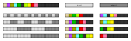
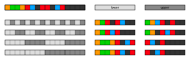
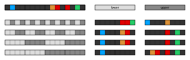

# fission Walsh spectra

The property `fission_walsh_spectra` contains the [`walsh_spectrum`](../../methods/walsh_spectrum) of each function in [`fissions`](../fissions).

The derived property `fission_walsh_spectra_abs` is the same without minus signs.

## examples

### dakota

### fatale

### savona

