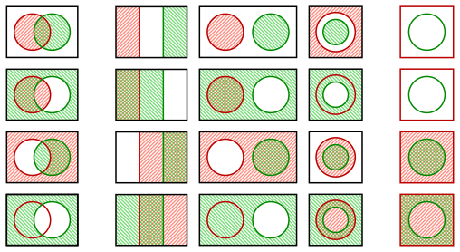

A split is the generalization of a set, where it does not matter which side is considered the inside and which the complement.

There are three ways two different splits can relate to each other:

* **left**: The borders cross, and there are **4** overlaps.
* **middle**: The borders do not cross, and there are **3** overlaps.
  This case can be seen as disjoint sets (row 1, middle), sets in a subset relation (row 3, right)
  or intersecting sets whose union is the universe (row 4, left).
* **right**: One of the sets is the universe, and thus contains the other one. There are only **2** overlaps. (case **2u**)

So to find out how two splits are related to each other, one has to check how many of the four possible intersections are empty.

The graphic shows only the cases where the splits are different. But there are also these cases where they are the same:

* None of the two sides is empty. In this case there are also **2** overlaps. (case **2e**)
* One of the two sides is empty — so the other one is the universe. There is only **1** overlap.
* Both of the two sides are empty. This is the unique case where the whole universe is empty. So there are **0** overlaps.

These other cases are shown in these images:
[Category:3-ary Boolean functions; BEC; nesting analysis](https://commons.wikimedia.org/wiki/Category:3-ary_Boolean_functions;_BEC;_nesting_analysis)
 
They also appear in `boolf.test.04_splits_overlap_counts`. 
(BEC 8 shows the cases **2e** and **2u**.)
