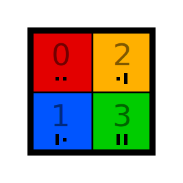
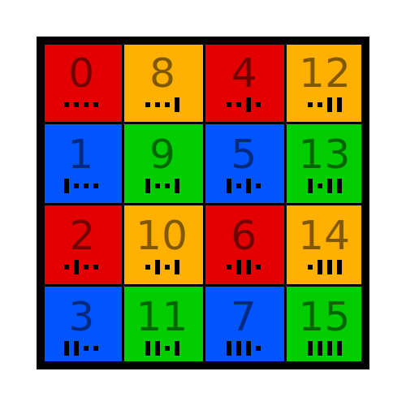

# quadrant

The quadrant combines [oddness](../_oddness/is_odd) and [odiousness](../_oddness/is_odious) into a number 0...3.

 

---

There is also the methods `patron_quadrant` ([here](../../methods/_patron)),
`weight_quadrant` and `octant` ([here](../../methods/_quadrant_extensions)).

See Commons [category](https://commons.wikimedia.org/wiki/Category:Quadrant_colors_in_hypercube_matrices_(image_set)).