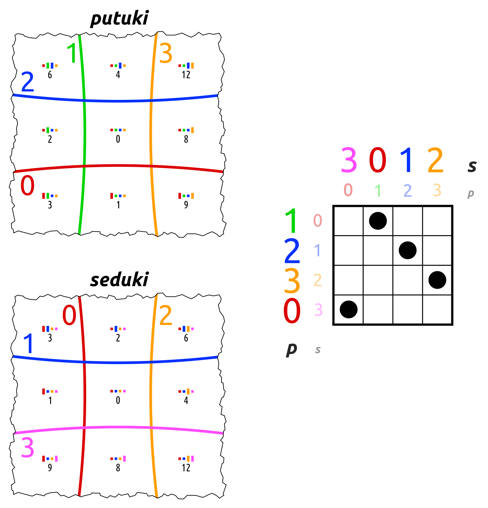
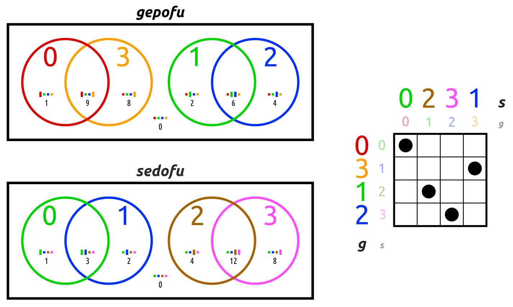
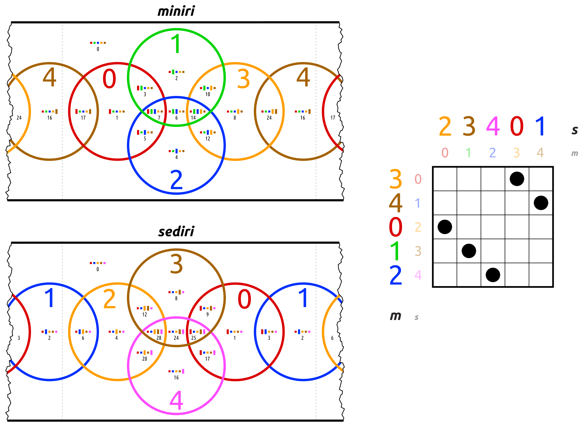

# conversions of filtrates of _barita_

see [documentation](https://en.wikiversity.org/wiki/Studies_of_Euler_diagrams/filtrates#barita)

## _seduki_ (like _putuki_)

```python
putuki.apply(3, 0, 1, 2) == filtrate_seduki.apply(0, 1, 2, 3)
putuki.apply(0, 1, 2, 3) == filtrate_seduki.apply(1, 2, 3, 0)
```

<a href="https://commons.wikimedia.org/wiki/File:EuDi;_barita_filtrate_seduki_and_putuki.svg">
    
</a>


## _sedofu_ (like _gepofu_)

There are 8 ways to express each of these permutations by the other one.
One of them is this:<br>
```python
gepofu.apply(0, 2, 3, 1) == filtrate_sedofu.apply(0, 1, 2, 3)
gepofu.apply(0, 1, 2, 3) == filtrate_sedofu.apply(0, 3, 1, 2)
```

The 8 permutations to get from _gepofu_ to _sedofu_ are those with the index numbers 3, 5, 9, 11, **12**, 14, 18, 20.
(See [here](https://commons.wikimedia.org/wiki/File:Symmetric_group_4;_permutation_list_(0-based).svg).)


<a href="https://commons.wikimedia.org/wiki/File:EuDi;_barita_filtrate_sedofu_and_gepofu.svg">
    
</a>


## _sediri_ (like _miniri_)

There are 4 ways to express each of these permutations by the other one.
One of them is this:<br>
```python
miniri.apply(2, 3, 4, 0, 1) == filtrate_sediri.apply(0, 1, 2, 3, 4)
miniri.apply(0, 1, 2, 3, 4) == filtrate_sediri.apply(3, 4, 0, 1, 2)
```
The four permutations to get from _miniri_ to _sediri_ are
(0, 3, 4, 2, 1), (0, 4, 3, 2, 1), **(2, 3, 4, 0, 1)**, (2, 4, 3, 0, 1).

<a href="https://commons.wikimedia.org/wiki/File:EuDi;_barita_filtrate_sediri_and_miniri.svg">
    
</a>

