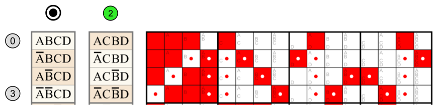
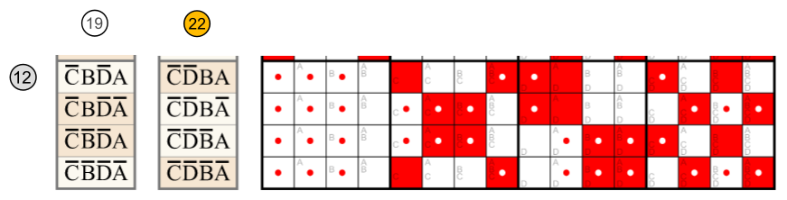
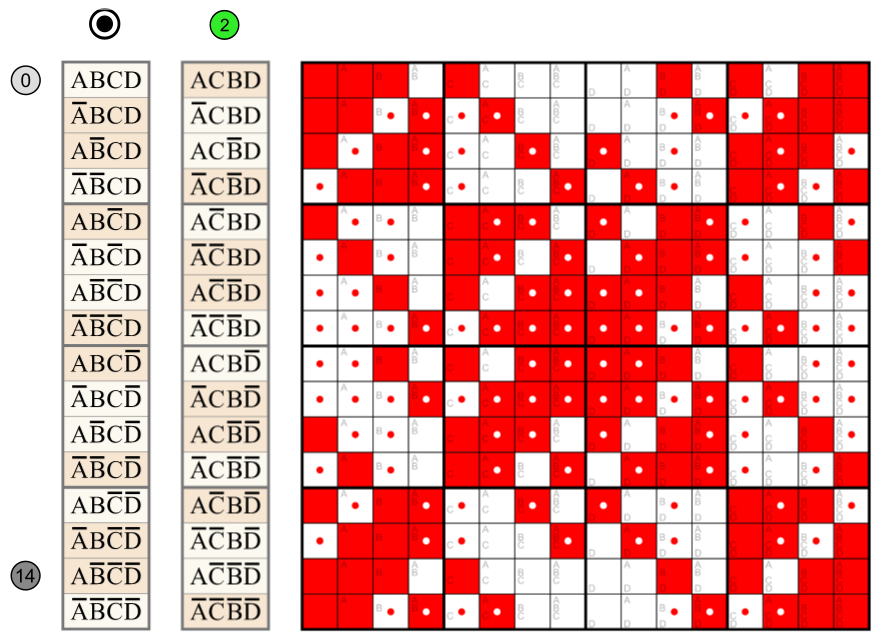
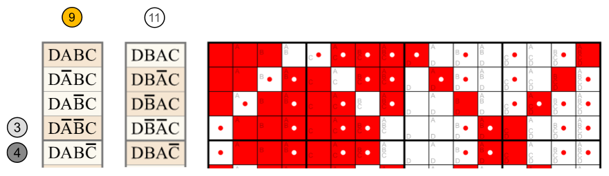

```python
from discretehelpers.boolf import Boolf
from discretehelpers.binv import Binv

boolf = Boolf('1010 1100')
```

## `val` simple

`val` takes boolean arguments, and returns one boolean value. The number of arguments is `valency` (not `arity`).

```python
boolf.val(0, 0, 0) == True
boolf.val(1, 0, 1) == True
boolf.val(0, 1, 1) == False
```

## `val` multiple

It can also take `Binv` objects or lists of booleans (of length _n_), and will return a `Binv` (of length _n_).

```python
v2 = Binv('010')
v4 = Binv('001')
v6 = Binv('011')

boolf.val(v2, v4, v6) == Binv('110')
```

## `vals`

`vals` is a shorthand to pass the truth tables (patterns) of (possibly negated) atomkeys to `val`, using their (possibly negated) integers.<br>
The integers denote atomkeys (not atomvals), so they are `0`...`n-1`,
even if the `Boolf` is spread.

```python
a = Binv('0101 0101')
b = Binv('0011 0011')
c = Binv('0000 1111')

boolf.vals(0, 1, 2) == boolf.val(a, b, c) == Binv('1010 1100') == boolf.root == boolf.tt()

boolf.vals(2, 0, ~1) == boolf.val(c, a, ~b) == Binv('1011 1000')
```

With non-negative arguments in natural order, the result equals the attribute `binv`
(and if [root](../../../metributes/is_root) also the method [`tt`](../../../methods/tt)).

## `apply`

`apply` is similar to `vals`, but returns `Boolf` instead of `Binv` objects.

```python
boolf.apply(0, 1, 2) == Boolf('1010 1100')

boolf.apply(2, 0, ~1) == Boolf('1011 1000')
```

# examples

## _kusaga_ (BEC 383)

<a href="https://commons.wikimedia.org/wiki/File:4-ary_Boolean_functions_in_BEC_383_from_1110_1000_0100_0010.svg#File">
    File:4-ary Boolean functions in clan 383 from 1110 1000 0100 0010.svg
</a><br>

<br>



## _damela_ (BEC 306)

<a href="https://commons.wikimedia.org/wiki/File:4-ary_Boolean_functions_in_BEC_306_from_1110_1000_0010_1011.svg#File">
    File:4-ary Boolean functions in clan 306 from 1110 1000 0010 1011.svg
</a><br>

<br>


