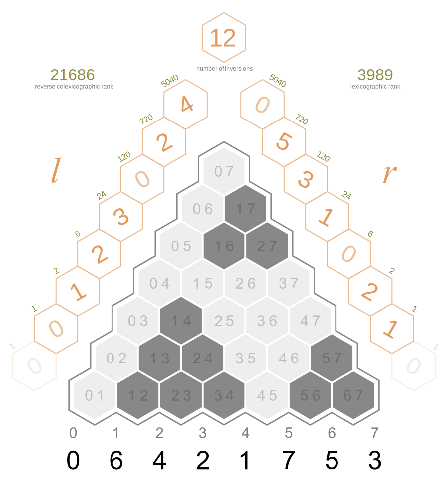
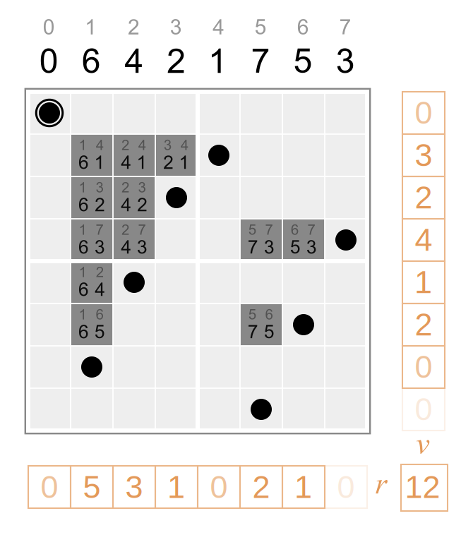

# inversion related vectors

Wikiversity: [Inversion (discrete mathematics)](https://en.wikiversity.org/wiki/Inversion_(discrete_mathematics))

The algorithm used in `right_inversion_count_to_permutation` comes from the following paper: 
*Alternative Representations for Codifying Solutions
in Permutation-Based Problems* by Malagon et al. (page 3)

`left_inversion_count_to_permutation` is similar. 
It is used in the helper [int_to_perm](../../../a/int_to_perm).

The following permutation is used in the first test:

