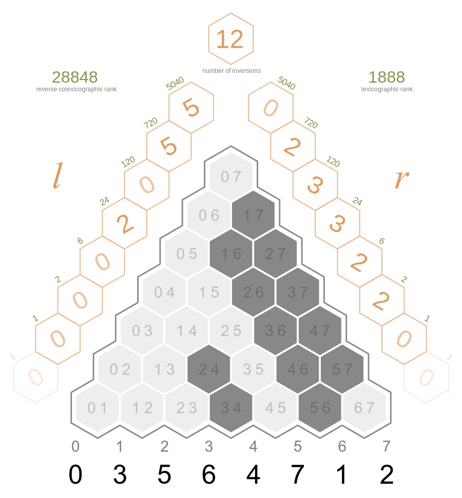

```python
from discretehelpers.perm import Perm


perm = Perm([0, 3, 5, 6, 4, 7, 1, 2])

assert perm.left_rank == 28848
assert perm.right_rank == 1888
```

<a href="https://commons.wikimedia.org/wiki/File:Walsh_permutation_354_inversions_triangle.svg">
    
</a>
