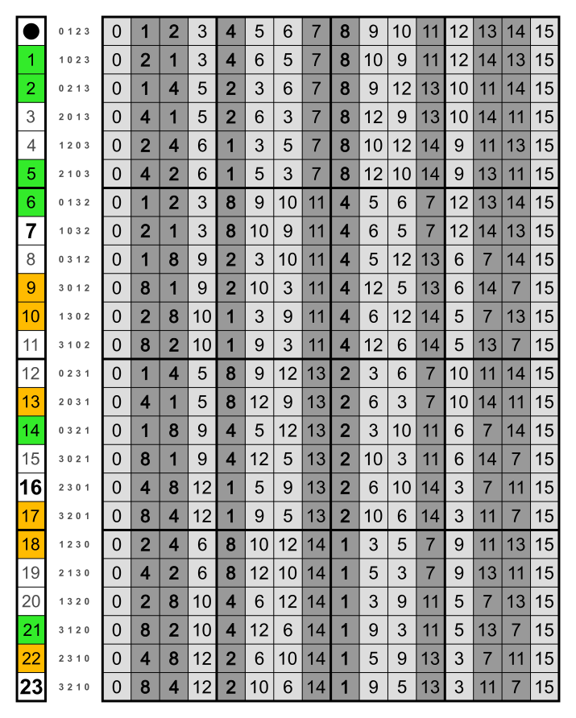
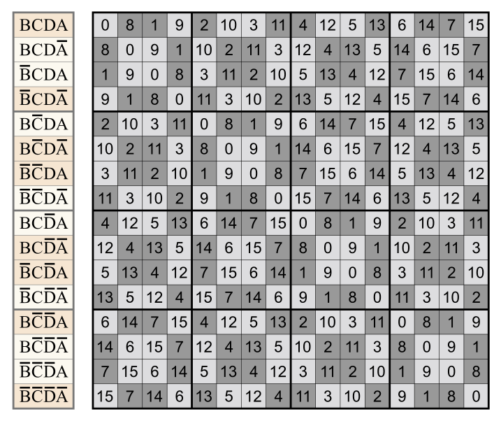

# Schoute perm

Let *p* be a finite permutation of length `n`.<br>
Then the Schoute permutation *P* is a periodic permutation with period length `2 ** n`.<br>
It corresponds to applying *p* to the binary digits of all natural numbers.<br>
Also to the permutation of hypercube vertices to applying *p* on the axes.

The following matrix shows the Schoute permutations corresponding to the first 24 finite permutations.<br>(This is an active Schoute matrix, showing the permutations as maps.)

<a href="https://commons.wikimedia.org/wiki/File:Consecutive_bit_permutations_24x16,_fixed_points_(sequences).svg">
    
</a>

The first [test](_test.py) corresponds to its row 9 of the matrix above.

```python
from discretehelpers.sig_perm import SigPerm


sigperm = SigPerm(pair=(0, 9))
schoute = sigperm.schoute_perm
assert schoute.sequence() == [0, 8, 1, 9, 2, 10, 3, 11, 4, 12, 5, 13, 6, 14, 7, 15]
```

## signed

This metribute is inherited by [SigPerm](../../../sig_perm).<br>
For a signed permutation it returns a permuted Schoute permutation.<br>
It shall be called a signed Schoute permutation (although it is not signed).

The first row of the following matrix is unsigned. The others are signed.<br>
But (unlike in the matrix above) they are represented by the results of applying them.<br>
Row 3 of this matrix is produced by `SigPerm(pair=(3, 18))`.<br>
This is `[~1, 2, 3, ~0]`. (Compare the letters on the left.) <br>
But to get this sequence, one has to use `inverse`.

<a href="https://commons.wikimedia.org/wiki/File:Tesseract_permutation_fixed_points_18.svg">
    
</a>

```python
sigperm = SigPerm(pair=(3, 18))
assert sigperm == SigPerm(sequence=[~1, 2, 3, ~0])
schoute = sigperm.schoute_perm
assert schoute.inverse.sequence() == [9, 1, 8, 0, 11, 3, 10, 2, 13, 5, 12, 4, 15, 7, 14, 6]
```

## name

There is no obvious name for this type of permutation, so this neologism was chosen.<br>
[Pieter Hendrik Schoute](https://en.wikipedia.org/wiki/Pieter_Hendrik_Schoute) has first described the permutohedron.<br>
See also [Schoute coset](../../../a/schoute_coset_gen).
