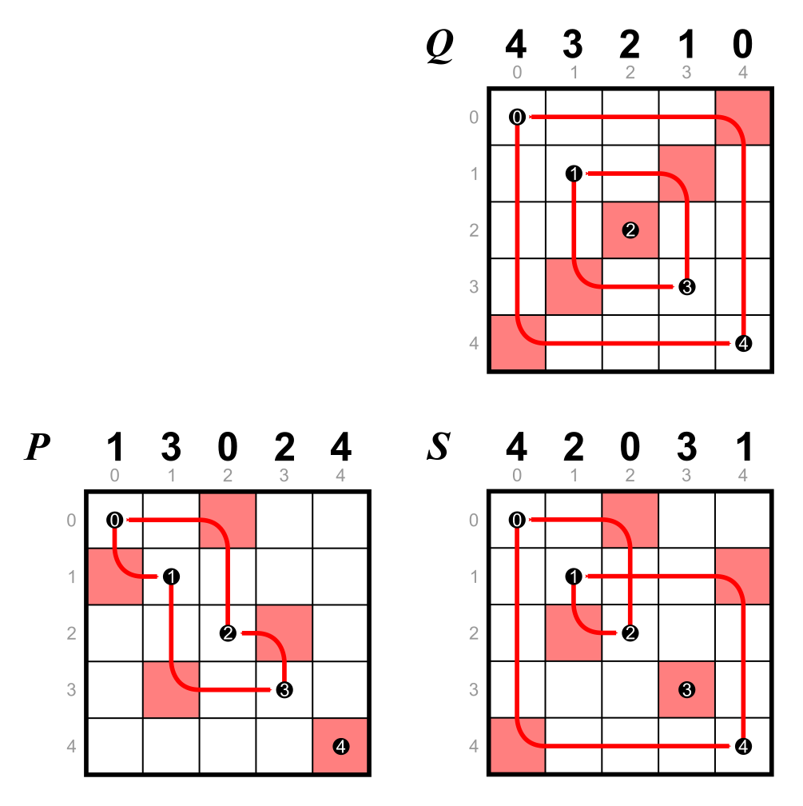
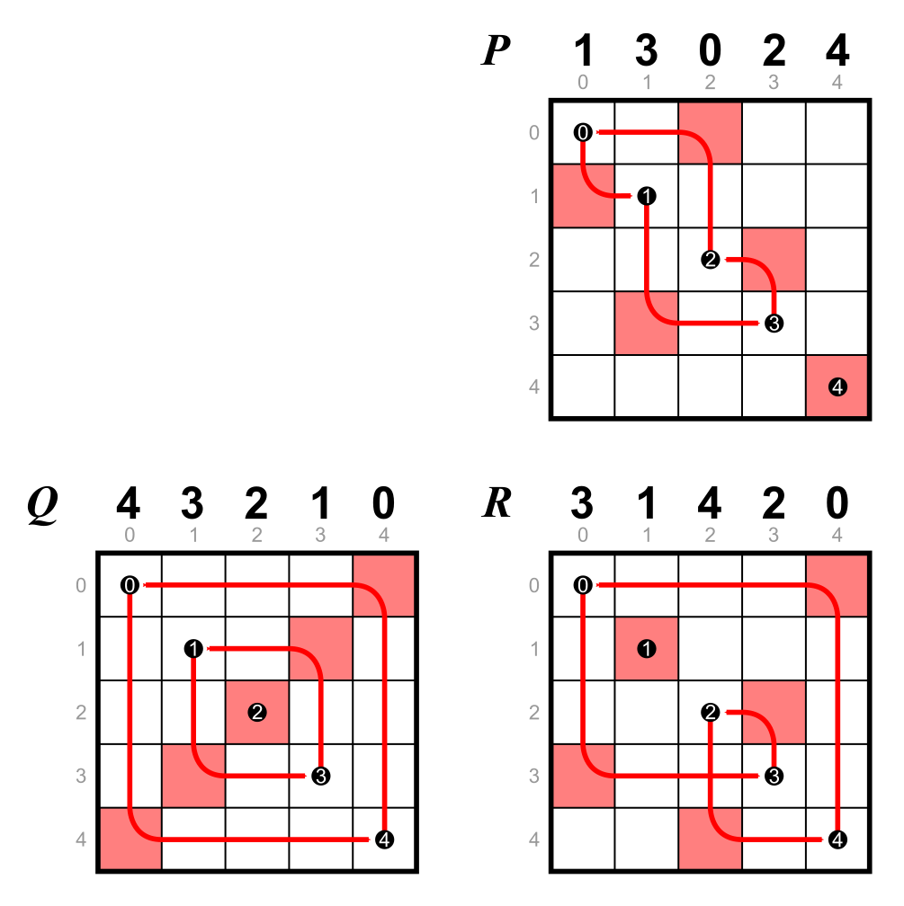
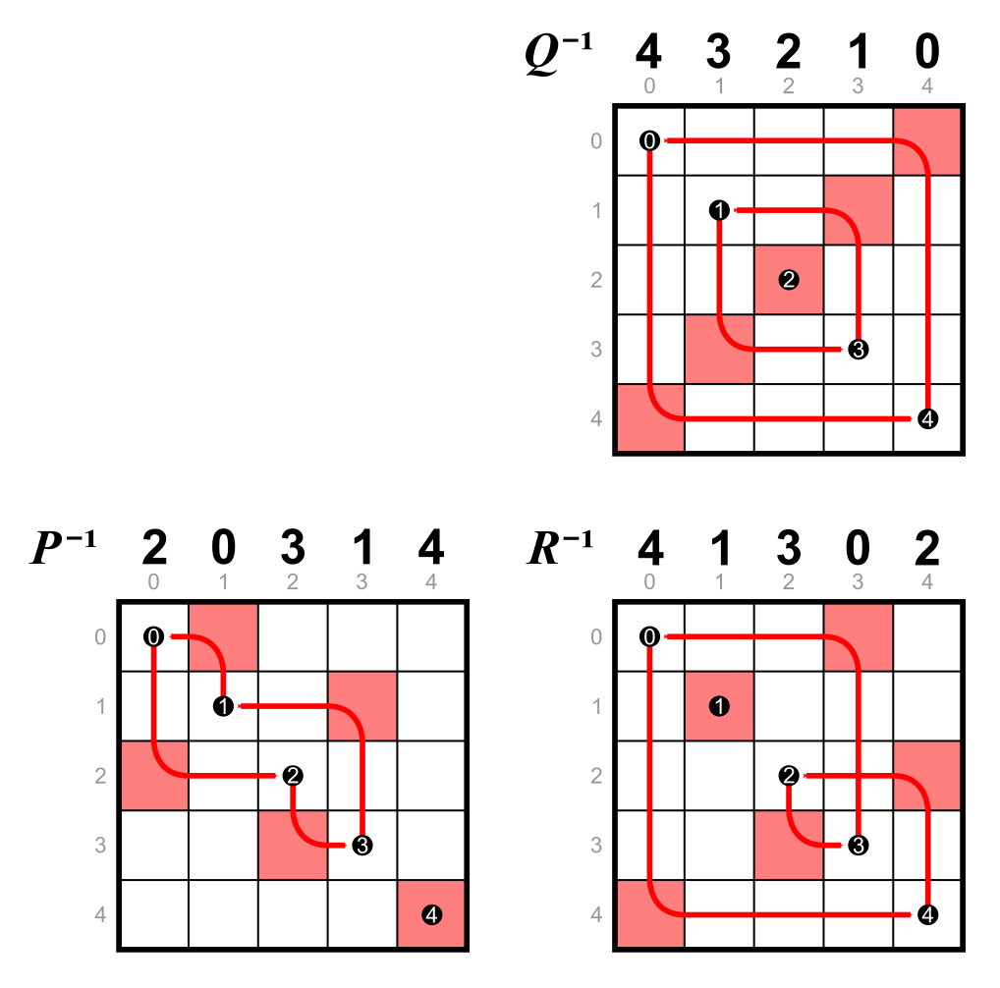
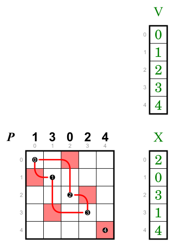
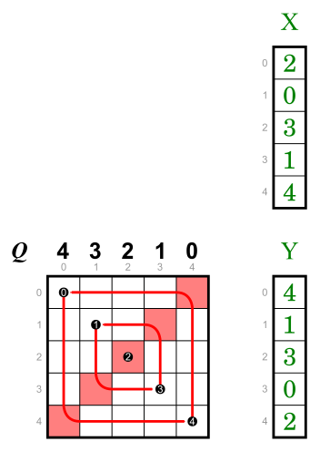
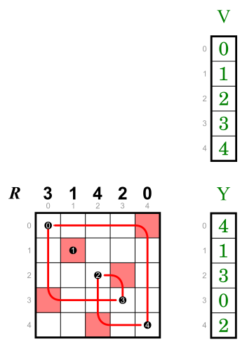

# concatenations

## P &middot; Q = S

## Q &middot; P = R

## P&minus;1 &middot; Q&minus;1 = R&minus;1

# vectors

<table>
    <tr>
        <td>
            
        </td>
        <td>
            
        </td>
        <td>
            
        </td>
    </tr>
</table>