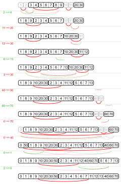

# `SetPartComp` (set partition with complement)

Describes a set partition with a complement relationship between the blocks.

- `equal_part` is a `SetPart` showing which elements are equal.
- `comp_pairs` is a set of pairs, each containing the smallest elements from two complementary blocks.

One method is `related_part()`.
It gives a `SetPart` where elements are in the same block, when they are equal or complementary.<br>
(It is `equal_part` with complementary blocks merged.)

## motivation

This was created to describe the `bloat` in [`Boolf`](../boolf).
Atoms can be equivalent, but also complementary.

Currently, the domain of the `SetPart` objects is Z rather than N, because in a blighted `Boolf` object<br>
the onesided splits are marked with `set_equal(atomkey, -1)` or `set_comp(atomkey, -1)`.

## graphical example

The corresponding code is in `test_with_image`. The initial object is: 
```python
SetPartComp([[3, 4], [5, 6, 7], [8, 9], [20, 30]], {(1, 2), (3, 8), (10, 11)})
```

<a href="https://commons.wikimedia.org/wiki/File:Set_partitions_with_complement_relation_between_blocks.svg">
    
</a>
