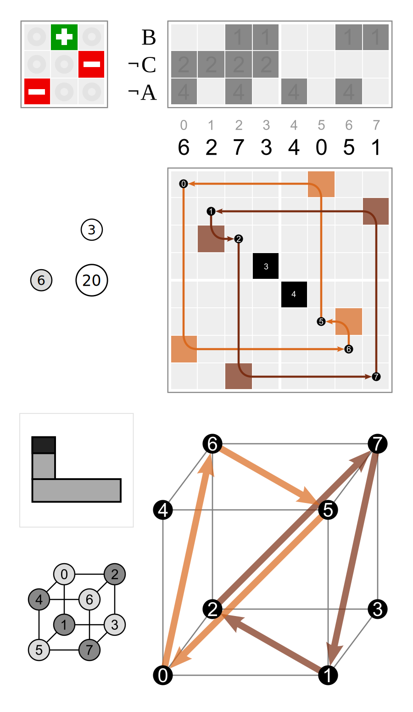
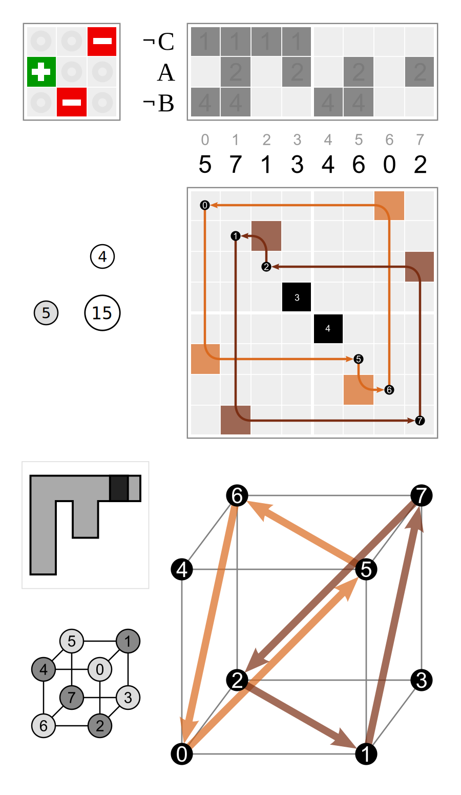
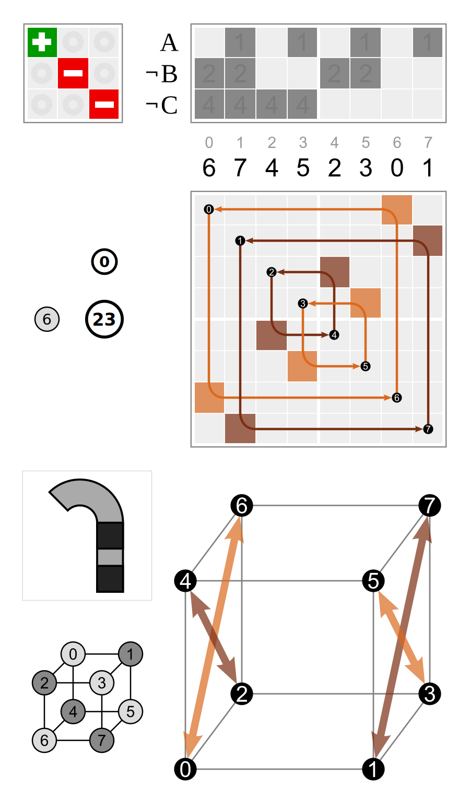
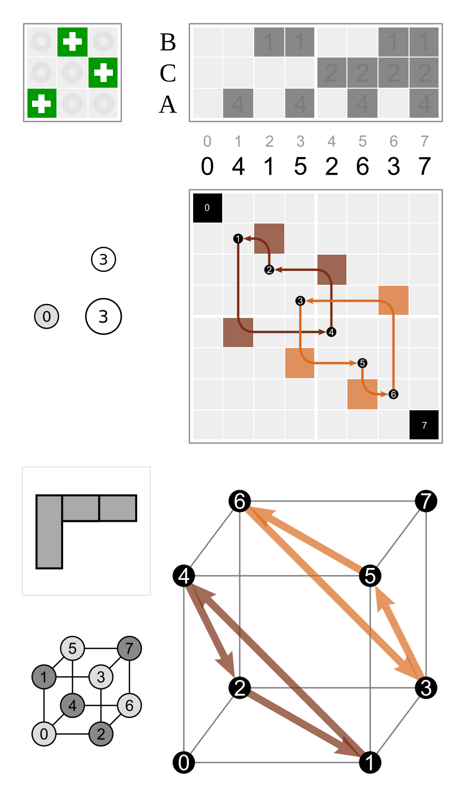
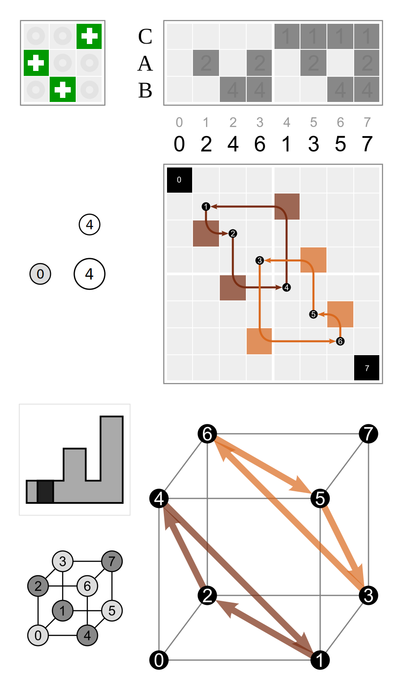

# `SigPerm` (signed permutation)

Wikiversity: [Discrete helpers/sig perm](https://en.wikiversity.org/wiki/Discrete_helpers/sig_perm)

```python
from discretehelpers.sig_perm import SigPerm
from discretehelpers.binv import Binv
from discretehelpers.perm import Perm


sp = SigPerm(valneg={1, 2}, perm=[2, 0, 1])

assert sp == SigPerm(sequence=[~2, 0, ~1])
assert sp == SigPerm(matrix=[[ 0,  1,  0],
                             [ 0,  0, -1],
                             [-1,  0,  0]])

assert sp.binv == Binv([0, 1, 1])
assert sp.perm == Perm([2, 0, 1])

assert sp.length == 3

assert sp.inverse == SigPerm(sequence=[1, ~2, ~0])
```

See also [tests](_test.py).

The negators are applied to the rows of the signed permutation matrix.<br>
In the sequence the negator pattern applies to values. (In `[~2, 0, ~1]` the values 1 and 2 are negated.)

----

The inverse signed permutation is the one with the transposed matrix.

<table style="float: right;">
    <tr>
        <td>(6, 3)</td>
        <td>(5, 4)</td>
    </tr>
    <tr>
        <td><code>[~2, 0, ~1]</code></td>
        <td><code>[1, ~2, ~0]</code></td>
    </tr>
    <tr>
        <td>
            <a href="https://commons.wikimedia.org/wiki/File:Cube_permutation_6_3.svg">
                
            </a>
        </td>
        <td>
            <a href="https://commons.wikimedia.org/wiki/File:Cube_permutation_5_4.svg">
                
            </a>
        </td>
    </tr>
</table>

## Schoute permutation

The images show a bijection between signed permutations of length _n_ and periodic permutations of period length 2<sup>_n_</sup>.<br>
The following code corresponds to the two inverses shown above:

```python
assert sp.schoute_perm == Perm([6, 2, 7, 3, 4, 0, 5, 1], perilen=8)
assert sp.inverse.schoute_perm == sp.schoute_perm.inverse == Perm([5, 7, 1, 3, 4, 6, 0, 2], perilen=8)
```

## products of unmoved and unsigned permutations

### unmoved * unsigned

The negator pattern is applied to the matrix _rows_. This is how `SigPerm` interprets the negator pattern in the argument `binv`.

<table>
    <tr>
        <td>(6, 0)</td>
        <td rowspan="3">after</td>
        <td>(0, 3)</td>
        <td rowspan="3">=</td>
        <td>(6, 3)</td>
    </tr>
    <tr>
        <td><code>[0, ~1, ~2]</code></td>
        <td><code>[2, 0, 1]</code></td>
        <td><code>[~2, 0, ~1]</code></td>
    </tr>
    <tr>
        <td>
            <a href="https://commons.wikimedia.org/wiki/File:Cube_permutation_6_0.svg">
                
            </a>
        </td>
        <td>
            <a href="https://commons.wikimedia.org/wiki/File:Cube_permutation_0_3.svg">
                
            </a>
        </td>
        <td>
            <a href="https://commons.wikimedia.org/wiki/File:Cube_permutation_6_3.svg">
                
            </a>
        </td>
    </tr>
</table>

### unsigned * unmoved

The negator pattern is applied to the matrix _columns_.

<table>
    <tr>
        <td>(0, 4)</td>
        <td rowspan="3">after</td>
        <td>(6, 0)</td>
        <td rowspan="3">=</td>
        <td>(5, 4)</td>
    </tr>
    <tr>
        <td><code>[1, 2, 0]</code></td>
        <td><code>[0, ~1, ~2]</code></td>
        <td><code>[1, ~2, ~0]</code></td>
    </tr>
    <tr>
        <td>
            <a href="https://commons.wikimedia.org/wiki/File:Cube_permutation_0_4.svg">
                
            </a>
        </td>
        <td>
            <a href="https://commons.wikimedia.org/wiki/File:Cube_permutation_6_0.svg">
                
            </a>
        </td>
        <td>
            <a href="https://commons.wikimedia.org/wiki/File:Cube_permutation_5_4.svg">
                
            </a>
        </td>
    </tr>
</table>

## array of signed permutations

Every signed permutation of _n_ elements has its place in a 2<sup>_n_</sup> × _n_! matrix.<br>
The rows correspond to negator patterns in little-endian binary order,<br>
and the columns to permutations in reverse colexicographic order.

It may be counter-intuitive, that the _true_ entries in `binv` correspond to negators.<br>
But this way the signed permutations form a consistent matrix with the unsigned permutations in the first row.
