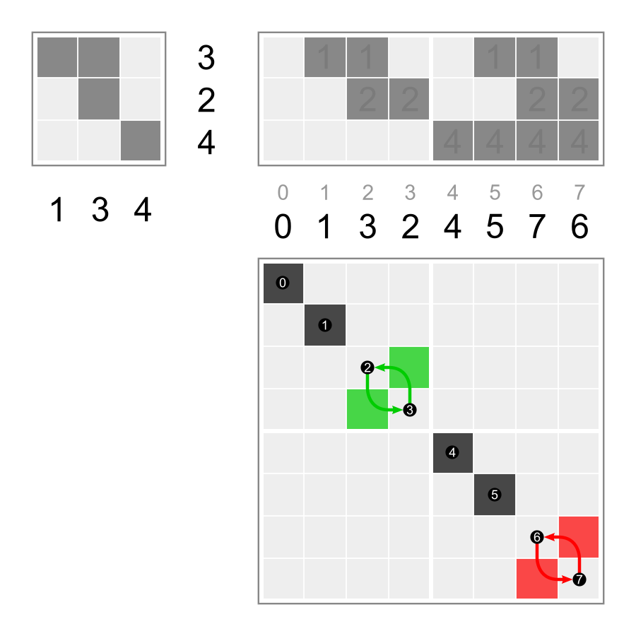
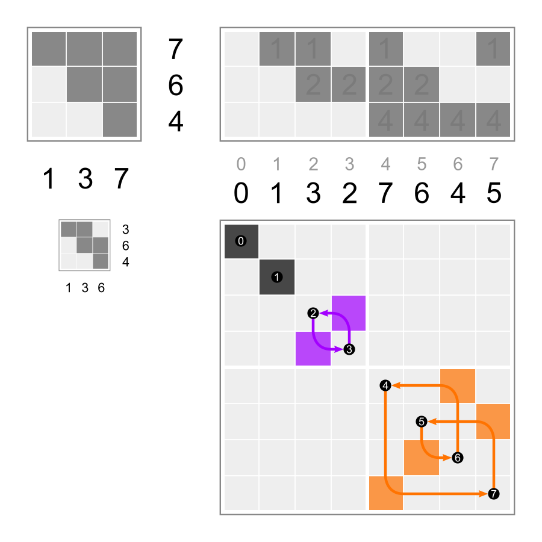
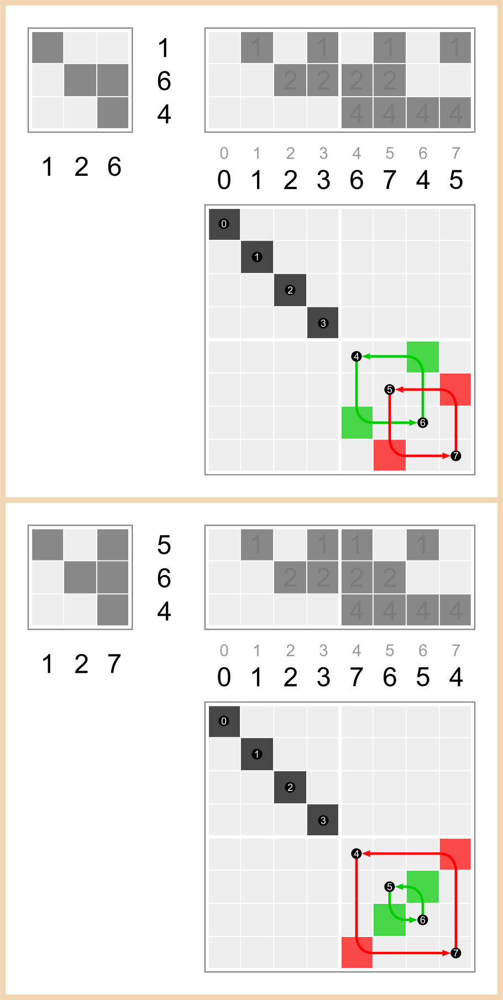
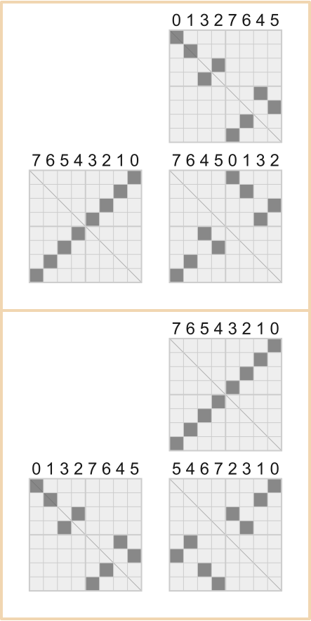

# `WalshPerm` (Walsh permutation)

Wikiversity: [Discrete helpers/walsh perm](https://en.wikiversity.org/wiki/Discrete_helpers/walsh_perm)

`WalshPerm` is a subclass of `Perm`, so it has all its features and some on top.<br>
Every Walsh permutation is a periodic permutation, so above all it has `cycles` and `perilen`.<br>
The main additional feature is the binary matrix, internally stored as `matrix_minimal` and accessible as `matrix()`.<br>
The vector is its abbreviation, internally stored as `vector_object` and accessible as `vector()`.

This page is user documentation. Technical details are [here](README_dev.md).

```python
import numpy as np
from discretehelpers.perm import Perm
from discretehelpers.walsh_perm import WalshPerm
```

## initialize

```python
vector = (3, 7, 1)

matrix = np.array([[1, 1, 1],
                   [1, 1, 0],
                   [0, 1, 0]])

sequence = [0, 3, 7, 4, 1, 2, 6, 5]

perm_finite = Perm(sequence)
perm_periodic = Perm(sequence, perilen=8)

wp = WalshPerm(vector=vector)
assert wp == WalshPerm(matrix=matrix)
assert wp == WalshPerm(perm=sequence)
assert wp == WalshPerm(perm=perm_finite)
assert wp == WalshPerm(perm=perm_periodic)
```

## properties

### wp(1, 3)

<a href="https://commons.wikimedia.org/wiki/File:Walsh_permutation_134.svg">
    
</a>

```python
perm = Perm([0, 1, 3, 2], perilen=4)
matrix = np.array([[1, 1],
                   [0, 1]])

wp = WalshPerm(vector=(1, 3))

assert wp == perm == WalshPerm(matrix=matrix)
assert wp.degree == 2  # minimal vector length and matrix size
assert wp.perilen == 4  # period length of the sequence

assert wp.cycles == [[2, 3]]
assert wp.mapping == {2: 3, 3: 2}

assert wp.cycles_dynamic(degree=2) == [[2, 3]]  # same as `wp.cycles_dynamic()` and `wp.cycles`
assert wp.cycles_dynamic(degree=3) == [[2, 3], [6, 7]]
assert wp.cycles_dynamic(degree=4) == [[2, 3], [6, 7], [10, 11], [14, 15]]

assert wp.sequence(degree=2) == [0, 1, 3, 2]  # same as `wp.sequence()`
assert wp.sequence(degree=3) == [0, 1, 3, 2, 4, 5, 7, 6]
assert wp.sequence(degree=4) == [0, 1, 3, 2, 4, 5, 7, 6, 8, 9, 11, 10, 12, 13, 15, 14]

assert np.array_equal(wp.matrix(2),  matrix)  # same as `wp.matrix()`

matrix_3 = np.array([[1, 1, 0],
                     [0, 1, 0],
                     [0, 0, 1]])
assert np.array_equal(wp.matrix(3), matrix_3)

assert wp.vector(2) == (1, 3)  # same as `wp.vector()`
assert wp.vector(3) == (1, 3, 4)

assert wp == wp.inverse
```

### wp(1, 3, 7)

<a href="https://commons.wikimedia.org/wiki/File:Walsh_permutation_137.svg">
    
</a>

```python
perm = Perm([0, 1, 3, 2, 7, 6, 4, 5], perilen=8)
matrix = np.array([[1, 1, 1], 
                   [0, 1, 1], 
                   [0, 0, 1]])

wp = WalshPerm(vector=(1, 3, 7))

assert wp == perm == WalshPerm(matrix=matrix)
assert wp.degree == 3
assert wp.perilen == 8

assert wp.cycles == [[2, 3], [4, 7, 5, 6]]
assert wp.mapping == {2: 3, 3: 2, 4: 7, 5: 6, 6: 4, 7: 5}

assert wp.sequence(degree=3) == [0, 1, 3, 2, 7, 6, 4, 5]  # same as `wp.sequence()`
assert wp.sequence(degree=4) == [0, 1, 3, 2, 7, 6, 4, 5, 8, 9, 11, 10, 15, 14, 12, 13]

assert wp.cycles_dynamic(degree=3) == [[2, 3], [4, 7, 5, 6]]  # same as `wp.cycles_dynamic()` and `wp.cycles`
assert wp.cycles_dynamic(degree=4) == [[2, 3], [4, 7, 5, 6], [10, 11], [12, 15, 13, 14]]

assert np.array_equal(wp.matrix(3), matrix)  # same as `wp.matrix()`

matrix_4 = np.array([[1, 1, 1, 0],
                     [0, 1, 1, 0],
                     [0, 0, 1, 0],
                     [0, 0, 0, 1]])
assert np.array_equal(wp.matrix(4), matrix_4)

assert wp.vector(3) == (1, 3, 7)  # same as `wp.vector()`
assert wp.vector(4) == (1, 3, 7, 8)

assert wp.inverse == WalshPerm([1, 3, 6])

real_inverse_matrix = np.array([[ 1., -1.,  0.],
                                [ 0.,  1., -1.],
                                [ 0.,  0.,  1.]])
np.array_equal(np.linalg.inv(matrix), real_inverse_matrix)
np.array_equal(wp.inverse.matrix(), real_inverse_matrix % 2)

```

The real inverse matrix contains entries -1. Modulo 2 they become 1.

Like in `Perm` is possible to access elements. E.g. `wp[4]` is 7 and `wp.inverse[4]` is 6.

## products

### products of Walsh permutations



Multiplication is from the left, i.e. like the usual function composition.

```python
wp134 = WalshPerm(vector=(1, 3))
wp137 = WalshPerm(vector=(1, 3, 7))

assert wp134 * wp137 == WalshPerm([1, 2, 6])
assert wp137 * wp134 == WalshPerm([1, 2, 7])
```

This is the corresponding matrix multiplication:

```python
mat134 = wp134.matrix(3)
mat137 = wp137.matrix(3)

np.dot(mat134, mat137)
# array([[1, 2, 2],
#        [0, 1, 1],
#        [0, 0, 1]])

np.dot(mat137, mat134)
# array([[1, 2, 1],
#        [0, 1, 1],
#        [0, 0, 1]])
```

The real matrix products contain entries 2. Modulo 2 they become 0.

### products with other periodic permutations



Walsh permutations are and can be multiplied with periodic permutations.

```python
p = Perm([7, 6, 5, 4, 3, 2, 1, 0], perilen=8)

assert p * wp137 == Perm([[0, 7, 2, 4], [1, 6, 3, 5]], perilen=8)
assert (p * wp137).sequence(8) == [7, 6, 4, 5, 0, 1, 3, 2]

assert wp137 * p == Perm([[0, 5, 3, 7], [1, 4, 2, 6]], perilen=8)
assert (wp137 * p).sequence(8) == [5, 4, 6, 7, 2, 3, 1, 0]
```

## powers

`wp**0` is always `WalshPerm()`. `wp**-1` is always `wp.inverse`.

### square in the cycle graph

```python
assert wp137**2 == WalshPerm([1, 2, 5])
assert wp137**3 == WalshPerm([1, 3, 6])
assert wp137**4 == WalshPerm()
```

### heptagon in the cycle graph

```python
wp413 = WalshPerm(vector=(4, 1, 3))
exponent_to_cycle = dict()
for i in range(8):
    exponent_to_cycle[i] = (wp413**i).vector(3)
    
assert exponent_to_cycle == {
    0: (1, 2, 4), 
    1: (4, 1, 3), 
    2: (3, 4, 5), 
    3: (5, 3, 7), 
    4: (7, 5, 6), 
    5: (6, 7, 2), 
    6: (2, 6, 1), 
    7: (1, 2, 4)
}
```
